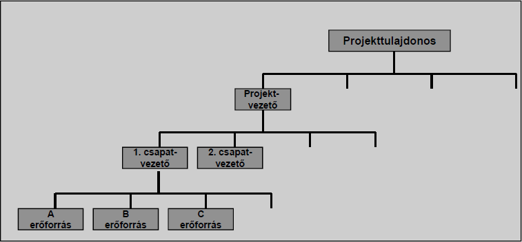
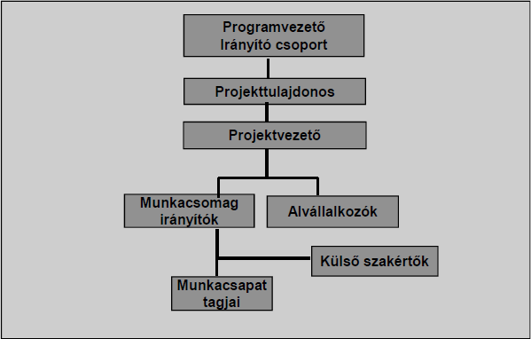

S1-05 Projektirányítás az informatikában
=======================================
Tartalom
---------------------------------------

1. [Informatikai projektek specialitásai és típusai](#chapter01)
2. [A projekt politikai, gazdasági és jogi környezete](#chapter02)
3. [Vállalati szintű tervezés, vállalatok életciklusai](#chapter03)
4. [Projekt szervezet felépítése](#chapter04)
5. [A projekt életciklusa](#chapter05)
6. [Projekttervezés](#chapter06)
    + [feladat és szervezet lebontási struktúra](#section06_01)
    + [időelemzés](#section06_02)
    + [kritikus út meghatározása](#section06_03)
    + [erőforrás-ütemezés](#section06_04)
    + [költségvetés hozzárendelése](#section06_05)
    + [kritikus lánc módszer](#section06_06)
7. [A projektet kísérő folyamatok](#chapter07)
8. [Projektirányítási módszertanok](#chapter08)
9. [Projektirányítás emberi vonatkozásai](#chapter09)
10. [További források](#references)

1.Informatikai projektek specialitásai és típusai 
---------------------------------------

### Alapfogalmak

**Projekt**: 

* _def. 1_: A projekt a kitűzött CÉL érdekében kölcsönösen egymásra ható tevékenységek csoportja, mely magába foglal
idő-, költség-, erőforrás-, terjedelem-, és minőségtényezőket.
* _def. 2_: Egy projekt egyedi folyamatcsoportok összessége, melyek összehangolt és felügyelt tevékenységeket jelentenek
kezdési és befejezési dátumokkal a projektcélok megvalósítása érdekében.

### Informatikai projektek specialitásai

Az informatikai projektek első, és legfontosabb jellemzője, hogy **önmagában nincs informatikai projekt**.
Egy informatikai projekt a legtöbb esetben valamilyen köztes lépés, egy nagyobb projekt része. Ezen felül egy
informatikai projekt specialitásai a következők:

* Sok projektszereplő
* Sok szakismeret
* A termék megfoghatatlan, változó és bonyolult
* A fejlesztési folyamat nehezen szabványosítható
* Bonyolult, sokrétű vevőkapcsolat
* Nagy kockázat, egyediség
* Nagy függés a felhasználói oldal vállalati kultúrájától

### Informatikai projektek típusai

* Szoftver(termék) fejlesztési projekt
* Alkalmazásfejlesztési projekt
* Alkalmazásintegrációs projekt
* Rendszerintegrációs projekt
* Bevezetési projekt
* Infrastruktúra fejlesztési projekt
* "Tanulmánykészítési" projekt (előkészítés, felmérés, bevizsgálás)
* Tesztelési projekt

**DE** leginkább ezeknek a keverékeiből áll össze egy informatikai projekt

2.A projekt politikai, gazdasági és jogi környezete 
---------------------------------------
3.Vállalati szintű tervezés, vállalatok életciklusai 
---------------------------------------

A vállalati szintű tervezés egyik legfontosabb kérdése a szervezeti felépítés. Ezek a szervezetek lehetnek formálisak,
melyek tulajdonosi és/vagy vezetői döntések alapján jönnek létre. Illetve lehetnek informálisak, melyek spontán emberi
kapcsolatok alapján jönnek létre. Egy vállalat életében mindkét fajta szervezet fontos, és érdemes mind a kettőre
egyaránt odafigyelni.

### Szerezetek fajtái:

* Egyszerű szervezet

_Előnyök_: gyors döntés, rugalmasság, csapatmunka, kreativitás

_Hátrányok_: bizonyos mértéken túl nem működőképes, szervezetlenség, kiszolgáltattság az egyszemélyi vezetőnek

* Funkcionális szervezet

_Előnyök_: Szakértelem öszpontosítása, egyéni fejlődési lehetőség

_Hátrányok_: Nincs projekttulajdonos, gyenge kommunikáció, rugalmatlan, gyenge erőforrás koordináció

* Projekt csapat

_Előnyök_: Széles projektvezetői hatáskör, széles szakértelmű csapat, egyértelmű erőforrás hozzárendelés

_Hátrányok_: Szakértelem öszpontosítása elvész, csapatok közötti interaktivitás hiánya

A funkcionális szervezet és projekt csapat felépítésű szervezetek között léteznek még ún. mátrix felépítések, melyek
egyfajta átmenetet képeznek a kettő között. A megfelelő szervezeti modell kiválasztásának szempontjai közé tartozik 
a _az előfordulás gyakorisága_, azaz mennyire rutinszerű, gyakori a feladat, illetve a _projekt mérete_.

### Vállalatok életútja

A vállalatok életútja több lépcsőből áll, melyeket az ember életútjainak állomásaihoz lehet hasonlítani.

A különböző életciklusokban a vállalatoknak más-más célkitűzései vannak.

| Udvarlás                 | Csescemőkor | "Gyerünk-gyerünk"                | Serdülőkor | Férfikor              | Megállapodás         | Arisztokrácia | Korai bürokrácia | Bürokrácia                      | Halál  |
|--------------------------|-------------|----------------------------------|------------|-----------------------|----------------------|---------------|------------------|---------------------------------|--------|
| Szükségletek kielégítése | Készpénz    | Értékesítés, és piaci részesedés | Profit     | Értékesítés és profit | Status quo megőrzése | ROI           | Egyéni túlélés   | Külső és belső vállalatpolitika | Csodák |

4.Projekt szervezet felépítése 
---------------------------------------

A projektek szervezete nagyban függ a projekt méretétől, így méret szerint csoportosítjuk őket.

### Kis projekt szervezete

**Méret**: 3-5 fő

Az ilyen méretű projekteknél nincs szükség egy teljes projektvezetői pozícióra, így erre kétféle modell létezik:

1. A projektvezető egy személyben technikai vezető is, sőt tervezhet, fejleszthet is.
2. Egy adminisztratív projektvezetőhöz több kisebb projekt is tartozik. (Ebben az esetben valóban csak adminisztratív
munkát végez)

### Közepes projekt szervezete

**Méret**: 5-20 fő

Ennél a méretnél már általában külön munkatárs kell a projektvezető és a technikai vezető szerepekhez, a legtöbb
esetben már teljes-munkaidős projektvezető szükséges. Megkezdődik a további strukturálás (részcsapatok vezetővel, pl: 
fejlesztők, tervezők, részprojekt, stb.)

### Nagy projekt szervezete

**Méret**: 20+ fő

Ilyenkor már megjelennek a szervezeti egységeket koordináló irodák, bizottságok (projekt felügyelő bizottság, projektiroda),
megjelennek további vezetési szintek. Sok esetben már nem elég egy teljes-munkaidős pozíció a feladatkörök ellátására,
asszisztensi pozíciók is megjelennek.

5.A projekt életciklusa 
---------------------------------------
6.Projekttervezés 
---------------------------------------
### Feladat és szervezet lebontási struktúra 

### Időelemzés 

### Kritikus út meghatározása 

### Erőforrás-ütemezés 

### Költségvetés hozzárendelése 

### Kritikus lánc módszer 

7.A projektet kísérő folyamatok 
---------------------------------------
8.Projektirányítási módszertanok 
---------------------------------------

(Prince, PMBOK CMM és CMMI)

9.Projektirányítás emberi vonatkozásai 
---------------------------------------
10.További források 
---------------------------------------
* Előadás diasor