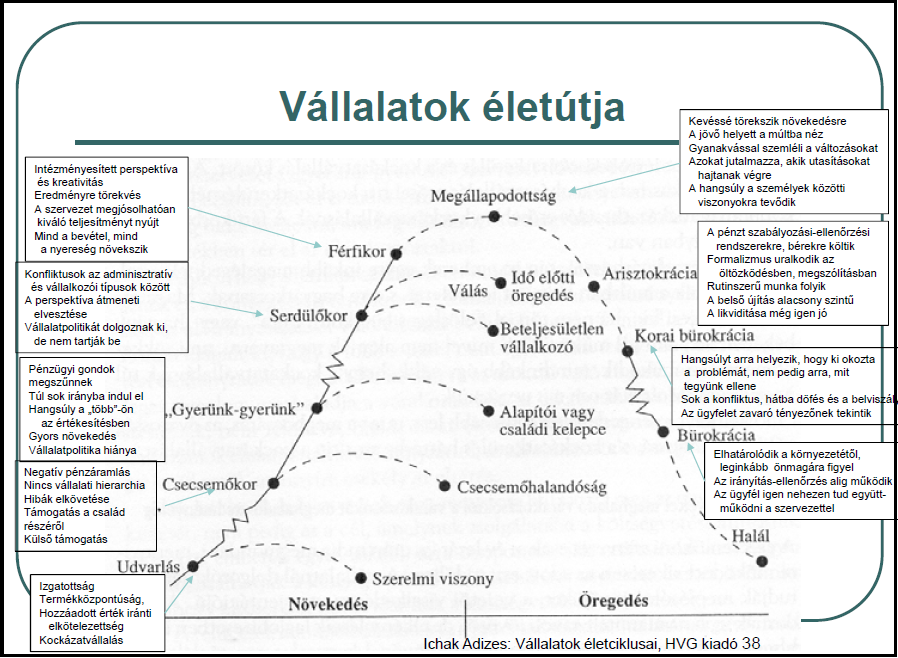
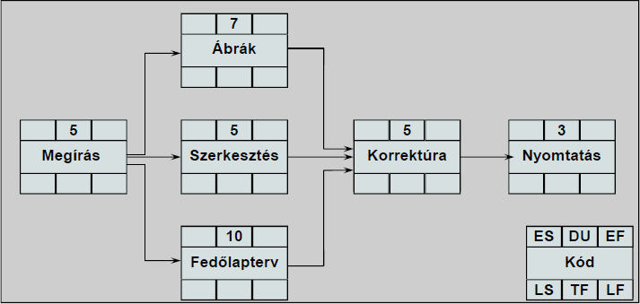
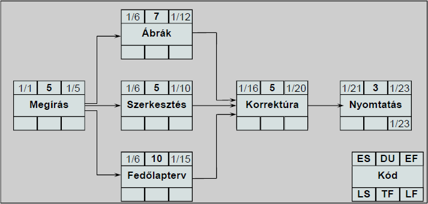
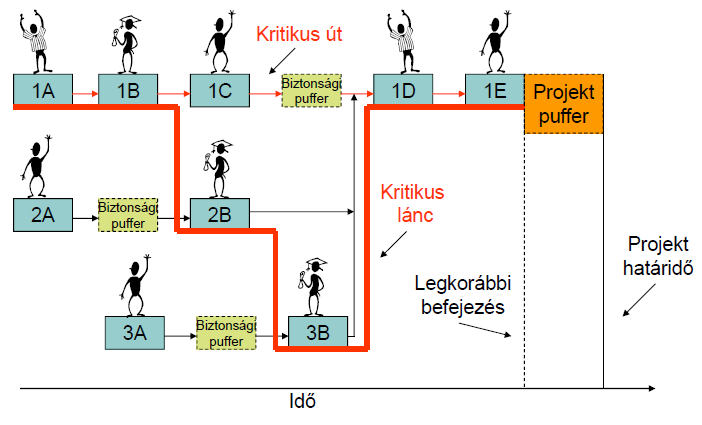
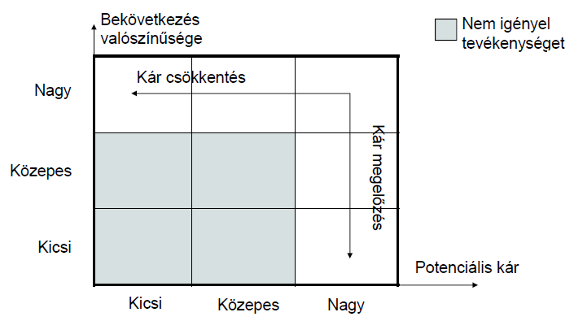
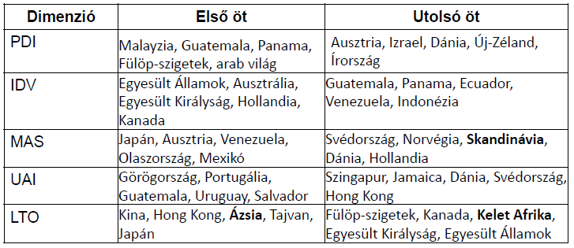
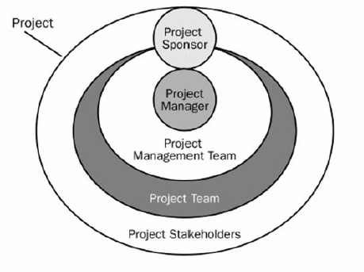
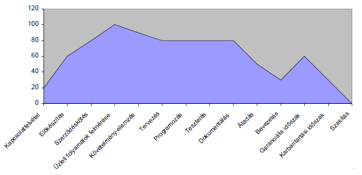
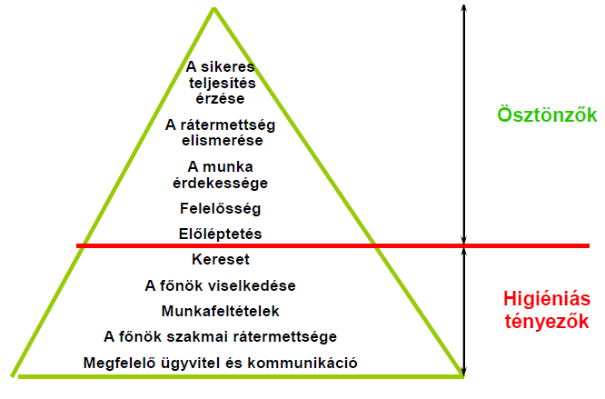

S1-05 Projektirányítás az informatikában
=======================================
Tartalom
---------------------------------------

1. [Informatikai projektek specialitásai és típusai](#chapter01)
2. [A projekt politikai, gazdasági és jogi környezete](#chapter02)
3. [Vállalati szintű tervezés, vállalatok életciklusai](#chapter03)
4. [Projekt szervezet felépítése](#chapter04)
5. [A projekt életciklusa](#chapter05)
6. [Projekttervezés](#chapter06)
    + [feladat és szervezet lebontási struktúra](#section06_01)
    + [időelemzés](#section06_02)
    + [kritikus út meghatározása](#section06_03)
    + [erőforrás-ütemezés](#section06_04)
    + [költségvetés hozzárendelése](#section06_05)
    + [kritikus lánc módszer](#section06_06)
7. [A projektet kísérő folyamatok](#chapter07)
8. [Projektirányítási módszertanok](#chapter08)
9. [Projektirányítás emberi vonatkozásai](#chapter09)
10. [További források](#references)

1.Informatikai projektek specialitásai és típusai 
---------------------------------------

### Alapfogalmak

**Projekt**: 

* _def. 1_: A projekt a kitűzött CÉL érdekében kölcsönösen egymásra ható tevékenységek csoportja, mely magába foglal
idő-, költség-, erőforrás-, terjedelem-, és minőségtényezőket.
* _def. 2_: Egy projekt egyedi folyamatcsoportok összessége, melyek összehangolt és felügyelt tevékenységeket jelentenek
kezdési és befejezési dátumokkal a projektcélok megvalósítása érdekében.

### Informatikai projektek specialitásai

Az informatikai projektek első, és legfontosabb jellemzője, hogy **önmagában nincs informatikai projekt**.
Egy informatikai projekt a legtöbb esetben valamilyen köztes lépés, egy nagyobb projekt része. Ezen felül egy
informatikai projekt specialitásai a következők:

* Sok projektszereplő
* Sok szakismeret
* A termék megfoghatatlan, változó és bonyolult
* A fejlesztési folyamat nehezen szabványosítható
* Bonyolult, sokrétű vevőkapcsolat
* Nagy kockázat, egyediség
* Nagy függés a felhasználói oldal vállalati kultúrájától

### Informatikai projektek típusai

* Szoftver(termék) fejlesztési projekt
* Alkalmazásfejlesztési projekt
* Alkalmazásintegrációs projekt
* Rendszerintegrációs projekt
* Bevezetési projekt
* Infrastruktúra fejlesztési projekt
* "Tanulmánykészítési" projekt (előkészítés, felmérés, bevizsgálás)
* Tesztelési projekt

**DE** leginkább ezeknek a keverékeiből áll össze egy informatikai projekt

2.A projekt politikai, gazdasági és jogi környezete 
---------------------------------------

### Politikai környezet

A vállalatokra közvetett hatással van a politikai környezet amelyben a vállalat él.

A politikai környezet tényezői:

* politikai stabilitás
* a politika beleszól a gazdaságba
* a politika döntéshozatal helyszínei (parlament, kormány, önkormányzat)
* a hatalmi ágak és azok együttműködése. A vállalat számára nem mindegy, hogy a konzervatív,
    liberális vagy szocialista irányelvek dominálnak

### Gazdasági környezet:

* már közvetlenül befolyásolja a vállalat életét.
* világgazdasági helyzet, haza gazdasági helyzet, gazdasági növekedés, infláció, beruházási kedv, koncepció
* az informatikai ipar érzékeny a gazdasági helyzetre, mert ha nem megy a gazdaság, akkor a gazdálkodó szervek
    rendszerint az informatikai kiadásokon kezdenek el takarékoskodni
* a munkanélküliség rossz, de rövid távon a vállalatok hasznot húzhatnak belőle, mert könnyebb munkaerőt találni

Gazdasági szempontból egy vállalatot a SWOT (Strengths-Weaknesses-Opportunities-Threats) analízis segítségével lehet
elemezni. Ennek négy eleme:

* Erősségek (strengths): Pozitív belső vállalati tényezők, amik a vállalkozás előnyei és fejleszthetjük

    (pl. jó termék, projekt struktúra, üzleti kapcsolatok, technológiai ismeret, stb.)

* Gyengesége(weaknesses): Negatív belső vállalati tényezők, amik a vállalkozás hátrányai és javíthatunk rajta

    (pl. kevés erőforrás, nem ismert a vállalat, kevés projektvezető, stb.)

* Lehetőségek (opportunities): Pozitív külső politikai- vagy gazdasági tényezők,
amiket nem tudunk befolyásolni, de kihasználhatjuk előnyként

    (pl. erős hazai/nemzetközi piaci pozíció, jó kapcsolatok, EU-s csatlakozás, stb.)

* Veszélyek (threats): Negatív külső politikai- vagy gazdasági tényezők, amiket nem tudunk befolyásolni,
de fel kell készülnünk rájuk

    (pl. csökkenő gazdasági növekedés, erős konkurencia, hazai viszonylatban drága, kormányzati kiadások csökkentése, stb.)

### A jogi környezet:

* egy-egy jogszabályhoz való alkalmazkodáshoz időre van szüksége a szervezeteknek

3.Vállalati szintű tervezés, vállalatok életciklusai 
---------------------------------------

A vállalati szintű tervezés egyik legfontosabb kérdése a szervezeti felépítés. Ezek a szervezetek lehetnek formálisak,
melyek tulajdonosi és/vagy vezetői döntések alapján jönnek létre. Illetve lehetnek informálisak, melyek spontán emberi
kapcsolatok alapján jönnek létre. Egy vállalat életében mindkét fajta szervezet fontos, és érdemes mind a kettőre
egyaránt odafigyelni.

### Szervezetek fajtái:

* Egyszerű szervezet

    { width=350 }

    _Előnyök_: gyors döntés, rugalmasság, csapatmunka, kreativitás

    _Hátrányok_: bizonyos mértéken túl nem működőképes, szervezetlenség, kiszolgáltattság az egyszemélyi vezetőnek

* Funkcionális szervezet

    { width=350 }

    _Előnyök_: Szakértelem öszpontosítása, egyéni fejlődési lehetőség

    _Hátrányok_: Nincs projekttulajdonos, gyenge kommunikáció, rugalmatlan, gyenge erőforrás koordináció

* Projekt csapat

    { width=350 }

    _Előnyök_: Széles projektvezetői hatáskör, széles szakértelmű csapat, egyértelmű erőforrás hozzárendelés

    _Hátrányok_: Szakértelem öszpontosítása elvész, csapatok közötti interaktivitás hiánya

A funkcionális szervezet és projekt csapat felépítésű szervezetek között léteznek még ún. mátrix felépítések, melyek
egyfajta átmenetet képeznek a kettő között. A megfelelő szervezeti modell kiválasztásának szempontjai közé tartozik 
a _az előfordulás gyakorisága_, azaz mennyire rutinszerű, gyakori a feladat, illetve a _projekt mérete_.

{ width=350 }

### Vállalatok életútja

A vállalatok életútja több lépcsőből áll, melyeket az ember életútjainak állomásaihoz lehet hasonlítani.

A különböző életciklusokban a vállalatoknak más-más célkitűzései vannak.

* Udvarlás -  Szükségletek kielégítése
* Csecsemőkor - Készpénz
* "Gyerünk-gyerünk" - Értékesítés, és piaci részesedés
* Serdülőkor - Profit
* Férfikor - Értékesítés és profit
* Megállapodás - Status quo megőrzése
* Arisztokrácia - ROI
* Korai bürokrácia - Egyéni túlélés
* Bürokrácia - Külső és belső vállalatpolitika
* Halál - Csodák

4.Projekt szervezet felépítése 
---------------------------------------

A projektek szervezete nagyban függ a projekt méretétől, így méret szerint csoportosítjuk őket.

### Kis projekt szervezete

**Méret**: 3-5 fő

Az ilyen méretű projekteknél nincs szükség egy teljes projektvezetői pozícióra, így erre kétféle modell létezik:

1. A projektvezető egy személyben technikai vezető is, sőt tervezhet, fejleszthet is.
2. Egy adminisztratív projektvezetőhöz több kisebb projekt is tartozik. (Ebben az esetben valóban csak adminisztratív
munkát végez)

### Közepes projekt szervezete

**Méret**: 5-20 fő

Ennél a méretnél már általában külön munkatárs kell a projektvezető és a technikai vezető szerepekhez, a legtöbb
esetben már teljes-munkaidős projektvezető szükséges. Megkezdődik a további strukturálás (részcsapatok vezetővel, pl: 
fejlesztők, tervezők, részprojekt, stb.)

{ width=400 }

{ width=400 }

### Nagy projekt szervezete

**Méret**: 20+ fő

Ilyenkor már megjelennek a szervezeti egységeket koordináló irodák, bizottságok (projekt felügyelő bizottság, projektiroda),
megjelennek további vezetési szintek. Sok esetben már nem elég egy teljes-munkaidős pozíció a feladatkörök ellátására,
asszisztensi pozíciók is megjelennek.

{ width=500 }

5.A projekt életciklusa 
---------------------------------------

A projekt életciklusát hat fázisra lehet osztani:

1. Projekt előkészítés
2. Projektindítás
3. Projekttervezés
4. Projekt követés
5. Projektzárás
6. Projekt utóélete

### Projekt előkészítés

A projekt előkészítése az **ajánlattétellel** kezdődik. Ekkor dől el, hogy az ügyfél elfogadja-e az ajánlatot, és ekkor
került a projektvezető kijelölésre. Ezek után a **Projekt definíciós dokumentum** (Projektterv) készül el, mely egy
élő dokumentum. Többek közt a projekt célja, a feladatok meghatározása, a szerepek, az időkeretek, stb lesznek benne
meghatározva. 

### Projektindítás

A projektet egy projektindítő gyűléssel (Kick-off meeting) szokták kezdeni, mely alatt a résztvevők megismerik a projekt
hátterét, célját, hierarchiáját, infrastruktúráját. Továbbá a felelősségi körökről, fontosabb eljárásokról is esik szó.

### Projekttervezés

A projekttervezés alá minden olyan tervezési folyamat esik, ami a projekt működéséhez szükséges. Ilyenek például az
időelemzés, erőforrás-ütemezés, stb.

### Projekt követés

A projekt követés a tervezés és a projektzárás közötti időtartam alatt a projekt megfigyelése. Ekkor fut a tényleges
projekt és készül a termék. Ebben a szakaszban információgyűjtés, adatösszeítés és elemzés (pl.: állapotjelentés,
teljesítmény mérés, stb.) után különböző cselekvések hajtódnak végre annak érdekében, hogy a projekt sikeresen záródjon.

### Projektzárás

Egy projekt kétféleképpen érhet véget:

* vagy teljesült a projekt cél
* vagy a cél teljesülése előtt különböző okokból:
    + üzleti okokból
    + műszaki okokból
    + terjedelem jelentős megváltozása miatt
    + időzítési okokból
    + költségvetési okokból
    + minőségi okokból
    + politikai okokból
    + emberi okokból

Egy projekt zárása után rendszerint keletkezik egy projektzáró dokumentum. Ennek a tartalma többek közt: a projekt adatai,
lezárást követő teendők, projekt értékelése, stb.

### Projekt utóélete

A projekt a projektzárással még nem mér véget teljesen. A projekt lezárása után még alábbi tevékenységek folyhatnak:

* Üzemeltetés
* Garanciális hibajavítás
* Karbantartás
* Támogató ügyeleti és készenléti tevékenység
* Követés (pl.: törvényi változások, kompatibilitás stb.)
* Továbbfejlesztés

6.Projekttervezés 
---------------------------------------
### Feladat és szervezet lebontási struktúra 

A projekttervezés egyik fő célja, hogy meghatározzuk:

* **MIT** kell csinálni?
* **KI** fogja megcsinálni?

Illetve az egyes feladatokat:

* **HOGYAN** csináljuk meg?
* **MIKOR** csináljuk meg?
* Milyen **KÖLTSÉGGEL** csináljuk meg?

Az első két kérdésre a válaszhoz a szervezet lebontási struktúrára (OBS - Organizational Breakdown Structure),
illetve feladat lebontási struktúrát (WBS - Work Breakdown Structure) van szükség.

Ezek után az OBS-t és WBS-t összevetve kiadhatjuk a feladatokat és meghatározhatjuk az felelősségeket.

{ width=450 }

A felelősségek ábrázolásának egy hatékony eszköze a RACI (Responsible, Accountable, Consulted, Informed) mátrix.

{ width=350 }

### Időelemzés 

Az időelemzés célja, hogy meghatározzuk a projek sikerességéhez szükséges időt, megállapítsuk a határidőt. Ehhez
egy eszköz az irányított hálók használata, melyben a csomópontok közötti élek az összefüggéseket jelentik. Ezek az
összefüggések lehetnek _követési kapcsolatokra_ vonatkozóak (pl. _"B csak akkor kezdődhet el, ha A befejeződött"_),
időre vontakozóak (pl.: X feladat nem fejeződhet be később, mint `<Dátum>` ). 

### Kritikus út meghatározása 

**Kritikus út**: azon tevékenységek sorozata, amely a projekt átfutási idejét meghatározza.

**Időjáték**: egy tevékenységet mennyivel lehet késleltetni anélkül, hogy bármely közvetlenül őt követő másik
tevékenység legkorábbi kezdése késést szenvedne.

#### Időterv

Az időterv a fentiekben leírtaknak megfelelő háló. Segítéségével meghatározhatjuk az _időjátékot_ és a _Kritikus utat_.
Egy tevékenységet a következőképp ábrázolhatunk az időtervben:

{ width=350 }

{ width=350 }

Az időterv értékeinek meghatározásához először előrefelé haladva meghatározzuk a tevékenységek legkorábbi
kezdéseit (ES - early start), és befejezéseit (EF - early finish) az időtartam (DU - duration) segítségével.

{ width=350 }

Majd visszafele haladva a legkésőbbi kezdéseket (LS - late start) és befejezéseket (LF - late finish) és
teljes időjátékot (TF - total float) határozzuk meg.

{ width=350 }

A kritikus útat azok a tevékenységek határozzák meg, melyek teljes időjátéka nulla.

{ width=350 }

### Erőforrás-ütemezés 

A projekttervezés másik fontos lépése az erőforrás-ütemezés. Ezzel a módszerrel lehetőség nyílik az
erőforrás-túlterhelés enyhítésére, megszűntetésére. Az erőforrás-túlterhelés megoldására többféle lehetősg létezik:

* az időjáték kihasználásával a nem kritikus tevékenységeket időben eltolva.
* további erőforrás bevonásával
* erőforrás átcsoportosításával
* túlórával
* határidő eltolással

Nagyjából preferncia is ilyen sorrendű, emiatt **nem megoldás az, ha nem veszünk róla tudomást**, mert a végén
csak az utolsó lehetősg marad.

### Költségvetés hozzárendelése 

A projekttervezés alatt a költségek megtervezése is rendkívül fontos, melynek elemei a következők:

* Áru költség
* Alvállalkozói költség
* Élőmunka költség
    + saját
    + alvállalkozói T&M
* Egyéb
    + utazás
    + oktaktás
    + helyiség bérlet
    + kommunikációs költség
    + reprezentáció

**Élőmunka-költség**: Munkaerő időegységnyi költsége szorozva a felhasznált időegységek számával. (Eltérhet a
projekttervtől, mert a rövid szabad időszakok nem használhatók ki teljesen)

### Kritikus lánc módszer 

A kritikus lánc módszer középpontjában a projektterv bizonytalanságai és a nehezen megkapható erőforrások állnak.

A kritikus lánc hasonló a kritikus úthoz, de az erőforrások is figyelembe vannak véve:

* kritikus lánc: leghosszabb út, ahol a kritikus erőforrásokat használjuk
* lényege: nehezen megkapható erőforrások minél jobban ki legyenek használva
* biztonsági puffer: tartalék idő a kritikus erőforrások előtt

{ width=350 }

7.A projektet kísérő folyamatok 
---------------------------------------

### Követelménykezelés

A követelménykezelés azt határozza meg, hogy a projekt mit hoz létre, illetve mekkora a projekt terjedelme.
Ezt a követelményspecifikációban rögzítik. A követelményspecifikáció egy élő dokumentum, mely egyre finomodik az
ajánlatkéréstől a követelményelemzési fázis befejezéséig. (Ajánlatkérés - Ajánlatadás - Szerződéskötés - Követelményelemzés)
A követelményspecifikáció ezután már csak a változáskezelés révén.

A jó követelményspecifikáció SMART:

* Specific - egyértelmű
* Measurable - mérhető
* Achievable - megvalósítható
* Relevant - tömör, lényegre törő, ellentmondásmentes
* Testable - tesztelhető

A követelmények priorizálására egy jó módszer a MoSCoW szabály:

* Must have - nélkülözhetelen
* Should have - fontos
* Could have - lehetne, rövidtávon nélkülözhető
* Would like to have - nélkülözhető, de szeretnénk

A követelmények különböző fajtái:

* stratégiai
* funkcionális
* technikai, technológiai
* teljesítmény
* más rendszerrel kapcsolatos
* minőségi
* logisztikai, végrehajtási
* teszt

### Változáskezelés

A változáskezelés nem létezik követelménykezelés és konfigurációkezelés nélkül. A követelménykezelés kell, hogy tudjunk
mihez viszonyítani, míg a konfigurációkezelés ahhoz kell, hogy követni tudjuk min változtattunk eddig.

A változáskezelésnek több célja van:

* az érintett felek jóváhagyásának megszerzése
* a módosítások hatásának felmérése, vizsgálata
* változtatási igények, módosítások dokumentálása

**Fontos: a hiba és problémakezelés nem változáskezelés**

### Kockázatkezelés

**kockázat**: annak a valószínűsége, hogy előre nem látható esemény következik be.

Kockázat fajtái:

* műszaki, technológiai, módszertani
* pénzügyi
* kereskedelmi
* erőforrás
* vállalati
* szervezeti

De az IT projekek 5 kulcskockázata:

* feladat méretének növekedése
* hiba az eredeti becslésben
* résztvevő (kulcs) munkatárs távozása
* érdekelt felek közötti egyetértés felborulása
* termelékenység szórása

A kockázatoknak számtalan oka lehet, pl.: pontatlan becslés, új technológia, kommunikációs probléma,
nem tisztázott felelősség, stb.

A kockázatok súlyosságát jellemzőik alapján tudjuk meghatározni:

* bekövetkezési valószínűség
* potenciális kár
* bekövetkezés várható időpontja

Ezek alapján egy kockázati mátrixot lehet definiálni és meghatázni, hogy milyen esetben mi a teendő.

{ width=350 }

8.Projektirányítási módszertanok 
---------------------------------------

A projektirányítási módszertanok a feladatok megoldásának, elvégzésének, kifejlesztésének módját adják meg, és ehhez
előírásokat, ajánlásokat nyújtanak.

### PRINCE 2

A PRINCE (PRojects IN Controlled Environments) egy folyamatorientált módszer a hatékony projektmenedzsmenthez.
A PRINCE 2 az Egyesült Királyságban a kormány által de facto sztenderdként alkalmazott módszer.

### PMBOK

A PMBOK (Project Management Body of Knowledge) teljes gyűjteménye a folyamatok, legjobb technikáknak, terminológiáknak,
és szabályoknak, melyek a projektmenedzsment iparban sztenderdként elfogadottak.

### CMM, CMMI

A CMMI (Capability Maturity Model Integration) a legjobb technikákat gyűjti össze annak érdekében, hogy
teljesítménybeli növekedést lehessen elérni bármilyen szervezet esetén.

9.Projektirányítás emberi vonatkozásai 
---------------------------------------

### Nemzeti és vállalati kultúra

#### Nemzeti kultúra
Geert Hofstede szerint a kulturális különbségeket 4+1 különböző dimenzióban lehet megfogalmazni:

* Hatalmi távolsági index (PDI)
* A bizonytalanság elkerülésére való hajlamot jelző index (UAI)
* Individuaizmus - Kollektivizmus (IDV)
* Férfiasság - Nőiesség (MAS)
* (Időorientáció) (LTO)

Az alábbi táblázatban láthatunk néhány példát ezekre az értékekre:

{ width=350 }

#### Vállalati kultúra

A vállalati kultúrának több megjelenési módja van, melyek között szerepel: vállalat története, küldetése,
vezetés stílusa, munkatársak viszonya, stb.

Hofstede szerint a nemzetekre meghatározott dimenziók vállalatokra korlátozottan alkalmazhatóak, ezért más dimenziókat
azonosított:

* folyamat orientáció - eredmény orientáció
    
    (kockázat kerülés, korlátozott erőfeszítések - ismeretlen helyzetek, maximuot nyújtják, kihívások)
* munka orientáció - ember orientáció
    
    (mukatársak boldogsága, döntéscsoportok - nyomás, egyéni döntéshozatal)
* parókiális - professzionális (helyi - kompozita)
    
    (szociális, családi háttér, vállalati normák + magánélet - csak a szakmai kompetencia, munkatársak előre gondolkodnak)
* nyitott - zárt
    
    (nyitottak az újakra, beilleszkedés - zárkózottság, titkolózás , több év is kellhet a beilleszkedéshez)
* szoros irányítású - laza irányítású
    
    (költségtudatosság, szigorú időkorlátok - költség nem érdekes, lazább időkorlátok, gyakori tréfálkozások)
* normatív - pragmatikus
    
    (Szabályvezérelt, eljárások fontosabbak az eredménynél, üzleti etika, becsület - Piacvezérelt, hangsúly a vevő igényein van)

### Projektek érintettjei és azok kapcsolatatai

Projekttel kapcsolatos érdekcsoportok:

* Vállakozó (végrehajtó) szervezeten belüli
    + Tulajdonosok
    + Felső vezetők
    + Kereskedők
    + Projekt vezetése
    + Projekt tagok
    + Alvállalkozók
* Megrendelő szervezeten belüli
    + Tulajdonosok
    + Felső vezetők
    + Felhasználók
    + Projekt vezetése
    + Projekt tagok

Kapcsolat az érdekcsoportok és a projekt között:

{ width=350 }

A szoftverfejelsztési projekt kritikus kapcsolatcsoportjai:

* Ügyfél - vállalkozó
* Felsővezetés - projektvezetés
* Projektvezető - projekttagok
* Projekt vezetői
* Projekttagok

### Ügyféllel való együttműködés

Az ügyfél-vállalkozó kapcsolatot különböző fázisokra tudjuk bontani.

| Fázis                                | Ügyfél szerepe                     | A kapcsolat hangulata                          |
|--------------------------------------|------------------------------------|------------------------------------------------|
| Előkészítés                          | Feladat meghatározás, tárgyalás    | bizalmatlan, aszimmetria                       |
| Szerződéskötés                       | aláírás                            | bizalmatlan, aztán felszabadult                |
| Követelményelemzés                   | interjú, visszacsatolás            | egy oldalon állnak, ügyfél kibeszélheti magát  |
| Tervezés                             | kérdésekre válasz, terve elfogadás | első megtorpanás (ügyfél fél az ismeretlentől) |
| Programozás, tesztelés, dokumetnálás | válasz kisebb kérdésekre           | béke (vihar előtti csend)                      |
| Átadás                               | átvétel                            | egymás idegeinek őrlése                        |
| Bevezetés                            | rendszer használatba vétele        | viták kora                                     |
| Garanciális időszak                  | Használat, néha panasz             | összecsiszolódás (vállalkozó kevésbé motivált) |
| Karbantartási időszak                | Használat, ritkább panasz          | belefáradnak egymásba                          |

A kapcsolat hőfokát pedig az alábbi grafikonon láthatjuk:

{ width=450 }

### Személyiségi modellek

A személyiségi modellek megpróbálják bizonyos személyiségi jegyek alapján csoportosítani az embereket. Segítenek a
csapat tagjainak kiválasztásában, motiválásában, a megfelelő kommunikáció kialakításában. Óvatosan kell azonban kezelni,
nem szabad embereket beskatulyázni, illetve vigyázni kell, mert az ilyen kategóriák önbeteljesítő tulajdonsággal
bírhatnak (egy egyén elhiszi, hogy valamelyik kategória tagja és valóban olyanná válik)

Többféle ilyen modell van, ezekből kettőt sorolunk fel.

#### Myers-Biggs Type Indicator (MBTI)

Négy féle dimenzió mentén megy a jellemzés:

1. Extrovertált (E) - Introvertált (I):
    
    Az energia forrása és iránya:
    I: belső koncentrációból
    E: külső kapcsolatokból
2. Érzékelő (S) - Intuitív (N)
    
    Információ megszerzésének módja:
    S: empirikus, érzékelt
    N: jó minták, absztrakció
3. Gondolkodó (T) - Érző (F)
    
    Az információ feldolgozása
    T: személytelen logika szerint
    F: személyes értékek szerint
4. Követő (J) - Rögtönző (P)
    
    A feldolgozott információ feldolgozása
    J: Mindent megszervez, tervek szerint cselekszik
    P: Improvizáció, alternatívák keresése

#### The Insights Framework

Az embereket négy szín alapján négy csoportba osztja.

| Szín  | Tulajdonság                            | Alapvető hozzáállás      |
|-------|----------------------------------------|--------------------------|
| Kék   | előítélet mentes, objektív             | Csináljuk jól!           |
| Zöld  | csendes, nyugodt, megnyugtató          | Csináljuk harmonikusan!  |
| Sárga | derűs, lelkesedő, talpraesett          | Csináljuk együt!         |
| Vörös | pozitív, megerősítő, merész,magabiztos | Csináljuk most!          |

### Csapatszerepek

A csapatszerepeket Dr. Meredith Belbin modellje alapján vizsgáljuk. Töbféle csapatszerepet definiált, melyeket
a személyiségi jegyek alapján kategorizált. Három fő csoportot alkotott, egyenként három alcsoporttal.

* Feladatközpontú szerep
    + Formáló: szerepek, határok, felelősségi körök kialakítása
    + Megvalósító: tervek, ötletek kipróbálása, megvalósítása,
    + Befejező: végrehajtási hibáktól való védelem, célok, határidők, múlasztások
* Emberközpontú szerep
    + Koordinátor: csoport céljai, delegáció, döntéshozatal
    + Csapatmunkás: diplomatikus, csapat tagok közötti interakció, csapatszellem
    + Lehetőségfelkutató: csoporton kívüli lehetőségek, ötletek, fejlemények
* Szellemi szerep
    + Ötletadó: Új ötletek, konstruktív, innovatív, 
    + Megfigyelő értékelő: problémaelemzés, helyzet, lehetőség, ötlet értékelés
    + Specialista: speciális szakértelem, csak bizonyos témák, néha hasznos, de akkor nagyon

### Vezetési szerepek, stílusok

A vezetési stílusokat Robert Blake és Jane Mouton elmélete alapján egy kétdimenziós rácson ábrázolva lehet jellemezni,
melynek dimenziói:

* figyelem az emberekre
* figyelem a termelésre

Ezek alapján pedig 5 fajta csoprotot lehet alkotni, ahogy az ábrán is látható:

{ width=350 }

* 1/1 - elszegényedett
    
    lehetetlen hatékony termlés, az emberek lusták, minimumot teszi meg, főnök mőgé bújik
* 1/9 - klubmenedszer
    
    barátság a lényeg, a termelés mellékes, barátságos légkör, emberi szükségletek
* 9/1 - zsarnok
    
    az emberek gépek, a legtöbbet kell kihozni belőlük, munka elvégzése az erőforrás árán is
* 5/5 - középutas
    
    első a termelés, de a hangulat is fontos, folyamatos engyensúlyozás,
    mindkettőt éppen az elvárásoknak megfelelően, könnyen kiég
* 9/9 - csapat menedzser
    
    hatékony munka előfeltétele a az emberi harmónia, bizalom, tiszteleten alapuló kapcsolat

Tanulság:

* Egyik sem recept mindenre (válsághelyzet vs. 9/9)
* Nem csak az emberi tényzező fontos
* Nem csak a mérhető tényező fontos

### Ösztönzés, ösztönzési elméletek

Az ösztönzésre meglehetősen sok elmélet és modell létezik. Az ösztönzés folyamata, egy folytonos, körkörös folyamat
a _kelégítetlen igény_, a _valamilyen célra irányuló tevékenység_, és az _igény kielégítése_ között.

Elton Mayo fogalmazta meg, hogy az embereknek a pénzen és a munkafeltételen kívül más igényeik is vannak, mint például
 az _elismerés_, a _valahova tartozás_, illetve a csoport is nagy hatással bír.
 
Abraham Marslow sorrendet állított fel az egyéb szükségletek között:

1. élettani igény
2. biztonsági igény
3. "tartozni valahova" igény
4. megbecsülés iránti igény
5. önmegvalósítás igénye

Frederick Herzberg ezeket a tényezőket két csoportra osztotta:

* Ösztönző tényezők: jelenlétük szükséges az elégedett munkavégzéshez
* Egészségügyi (higéniai) tényezők: ezek hiánya elégedetlenséghez vezet

Ezt az alábbi ábrán láthajuk:

{ width=350 }

Douglas McGregor két kisarkított elméletet alkotott meg:

* X elmélet:
    + az emberek nem szeretik, kerülik a munkát
    + kényszeríteni, fenyegetni kell az embereket
    + az emberek nem szeretik a felelősséget
    + az embereknek nincsenek ambícióik
* Y elmélet:
    + fizikai, szellemi erőfeszítés ugyanolyan munka közben, mint játék közben
    + az emberek önuralmat gyakorolnak, ha elfogadjék a szervezet céljait
    + az emberek elvállalják a felelősséget
    + az emberek öteltesek, alkotó szelleműek

10.További források 
---------------------------------------
* Előadás diasor
* https://www.prince2.com/eur/prince2-methodology
* https://www.wrike.com/project-management-guide/faq/what-is-pmbok-in-project-management/
* http://cmmiinstitute.com/capability-maturity-model-integration
