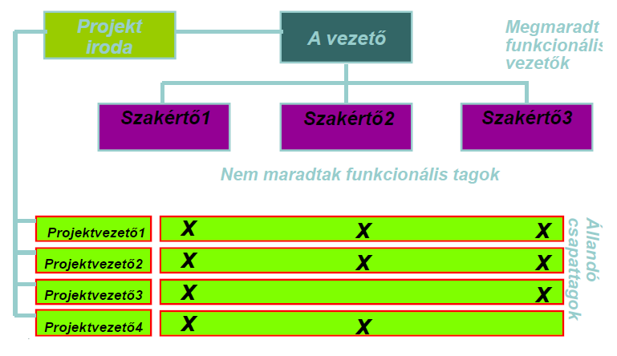
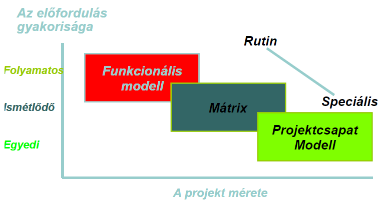
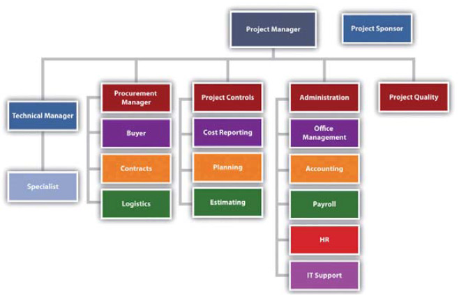
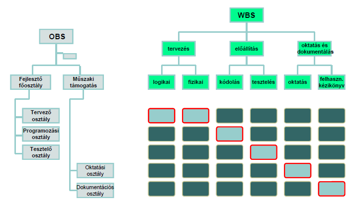
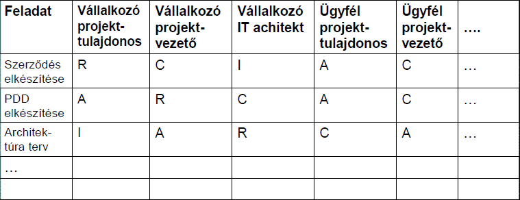
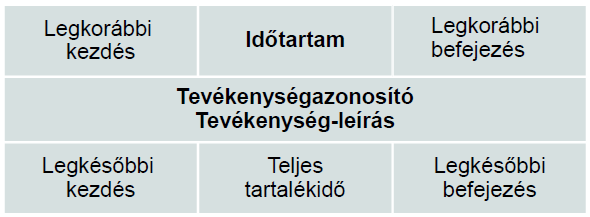
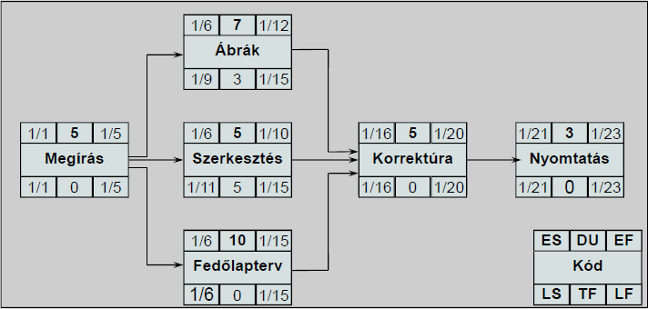

S1-05 Projektirányítás az informatikában
=======================================
Tartalom
---------------------------------------

1. [Informatikai projektek specialitásai és típusai](#chapter01)
2. [A projekt politikai, gazdasági és jogi környezete](#chapter02)
3. [Vállalati szintű tervezés, vállalatok életciklusai](#chapter03)
4. [Projekt szervezet felépítése](#chapter04)
5. [A projekt életciklusa](#chapter05)
6. [Projekttervezés](#chapter06)
    + [feladat és szervezet lebontási struktúra](#section06_01)
    + [időelemzés](#section06_02)
    + [kritikus út meghatározása](#section06_03)
    + [erőforrás-ütemezés](#section06_04)
    + [költségvetés hozzárendelése](#section06_05)
    + [kritikus lánc módszer](#section06_06)
7. [A projektet kísérő folyamatok](#chapter07)
8. [Projektirányítási módszertanok](#chapter08)
9. [Projektirányítás emberi vonatkozásai](#chapter09)
10. [További források](#references)

1.Informatikai projektek specialitásai és típusai 
---------------------------------------

### Alapfogalmak

**Projekt**: 

* _def. 1_: A projekt a kitűzött CÉL érdekében kölcsönösen egymásra ható tevékenységek csoportja, mely magába foglal
idő-, költség-, erőforrás-, terjedelem-, és minőségtényezőket.
* _def. 2_: Egy projekt egyedi folyamatcsoportok összessége, melyek összehangolt és felügyelt tevékenységeket jelentenek
kezdési és befejezési dátumokkal a projektcélok megvalósítása érdekében.

### Informatikai projektek specialitásai

Az informatikai projektek első, és legfontosabb jellemzője, hogy **önmagában nincs informatikai projekt**.
Egy informatikai projekt a legtöbb esetben valamilyen köztes lépés, egy nagyobb projekt része. Ezen felül egy
informatikai projekt specialitásai a következők:

* Sok projektszereplő
* Sok szakismeret
* A termék megfoghatatlan, változó és bonyolult
* A fejlesztési folyamat nehezen szabványosítható
* Bonyolult, sokrétű vevőkapcsolat
* Nagy kockázat, egyediség
* Nagy függés a felhasználói oldal vállalati kultúrájától

### Informatikai projektek típusai

* Szoftver(termék) fejlesztési projekt
* Alkalmazásfejlesztési projekt
* Alkalmazásintegrációs projekt
* Rendszerintegrációs projekt
* Bevezetési projekt
* Infrastruktúra fejlesztési projekt
* "Tanulmánykészítési" projekt (előkészítés, felmérés, bevizsgálás)
* Tesztelési projekt

**DE** leginkább ezeknek a keverékeiből áll össze egy informatikai projekt

2.A projekt politikai, gazdasági és jogi környezete 
---------------------------------------
3.Vállalati szintű tervezés, vállalatok életciklusai 
---------------------------------------

A vállalati szintű tervezés egyik legfontosabb kérdése a szervezeti felépítés. Ezek a szervezetek lehetnek formálisak,
melyek tulajdonosi és/vagy vezetői döntések alapján jönnek létre. Illetve lehetnek informálisak, melyek spontán emberi
kapcsolatok alapján jönnek létre. Egy vállalat életében mindkét fajta szervezet fontos, és érdemes mind a kettőre
egyaránt odafigyelni.

### Szerezetek fajtái:

* Egyszerű szervezet

_Előnyök_: gyors döntés, rugalmasság, csapatmunka, kreativitás

_Hátrányok_: bizonyos mértéken túl nem működőképes, szervezetlenség, kiszolgáltattság az egyszemélyi vezetőnek

* Funkcionális szervezet

_Előnyök_: Szakértelem öszpontosítása, egyéni fejlődési lehetőség

_Hátrányok_: Nincs projekttulajdonos, gyenge kommunikáció, rugalmatlan, gyenge erőforrás koordináció

* Projekt csapat

_Előnyök_: Széles projektvezetői hatáskör, széles szakértelmű csapat, egyértelmű erőforrás hozzárendelés

_Hátrányok_: Szakértelem öszpontosítása elvész, csapatok közötti interaktivitás hiánya

A funkcionális szervezet és projekt csapat felépítésű szervezetek között léteznek még ún. mátrix felépítések, melyek
egyfajta átmenetet képeznek a kettő között. A megfelelő szervezeti modell kiválasztásának szempontjai közé tartozik 
a _az előfordulás gyakorisága_, azaz mennyire rutinszerű, gyakori a feladat, illetve a _projekt mérete_.

### Vállalatok életútja

A vállalatok életútja több lépcsőből áll, melyeket az ember életútjainak állomásaihoz lehet hasonlítani.

A különböző életciklusokban a vállalatoknak más-más célkitűzései vannak.

| Udvarlás                 | Csescemőkor | "Gyerünk-gyerünk"                | Serdülőkor | Férfikor              | Megállapodás         | Arisztokrácia | Korai bürokrácia | Bürokrácia                      | Halál  |
|--------------------------|-------------|----------------------------------|------------|-----------------------|----------------------|---------------|------------------|---------------------------------|--------|
| Szükségletek kielégítése | Készpénz    | Értékesítés, és piaci részesedés | Profit     | Értékesítés és profit | Status quo megőrzése | ROI           | Egyéni túlélés   | Külső és belső vállalatpolitika | Csodák |

4.Projekt szervezet felépítése 
---------------------------------------

A projektek szervezete nagyban függ a projekt méretétől, így méret szerint csoportosítjuk őket.

### Kis projekt szervezete

**Méret**: 3-5 fő

Az ilyen méretű projekteknél nincs szükség egy teljes projektvezetői pozícióra, így erre kétféle modell létezik:

1. A projektvezető egy személyben technikai vezető is, sőt tervezhet, fejleszthet is.
2. Egy adminisztratív projektvezetőhöz több kisebb projekt is tartozik. (Ebben az esetben valóban csak adminisztratív
munkát végez)

### Közepes projekt szervezete

**Méret**: 5-20 fő

Ennél a méretnél már általában külön munkatárs kell a projektvezető és a technikai vezető szerepekhez, a legtöbb
esetben már teljes-munkaidős projektvezető szükséges. Megkezdődik a további strukturálás (részcsapatok vezetővel, pl: 
fejlesztők, tervezők, részprojekt, stb.)

### Nagy projekt szervezete

**Méret**: 20+ fő

Ilyenkor már megjelennek a szervezeti egységeket koordináló irodák, bizottságok (projekt felügyelő bizottság, projektiroda),
megjelennek további vezetési szintek. Sok esetben már nem elég egy teljes-munkaidős pozíció a feladatkörök ellátására,
asszisztensi pozíciók is megjelennek.

5.A projekt életciklusa 
---------------------------------------

A projekt életciklusát hat fázisra lehet osztani:

1. Projekt előkészítés
2. Projektindítás
3. Projekttervezés
4. Projekt követés
5. Projektzárás
6. Projekt utóélete

### Projekt előkészítés

A projekt előkészítése az **ajánlattétellel** kezdődik. Ekkor dől el, hogy az ügyfél elfogadja-e az ajánlatot, és ekkor
került a projektvezető kijelölésre. Ezek után a **Projekt definíciós dokumentum** (Projektterv) készül el, mely egy
élő dokumentum. Többek közt a projekt célja, a feladatok meghatározása, a szerepek, az időkeretek, stb lesznek benne
meghatározva. 

### Projektindítás

A projektet egy projektindítő gyűléssel (Kick-off meeting) szokták kezdeni, mely alatt a résztvevők megismerik a projekt
hátterét, célját, hierarchiáját, infrastruktúráját. Továbbá a felelősségi körökről, fontosabb eljárásokról is esik szó.

### Projekttervezés

A projekttervezés alá minden olyan tervezési folyamat esik, ami a projekt működéséhez szükséges. Ilyenek például az
időelemzés, erőforrás-ütemezés, stb.

### Projekt követés

A projekt követés a tervezés és a projektzárás közötti időtartam alatt a projekt megfigyelése. Ekkor fut a tényleges
projekt és készül a termék. Ebben a szakaszban információgyűjtés, adatösszeítés és elemzés (pl.: állapotjelentés,
teljesítény mérés, stb.) után különböző cselekvések hajtódnak végre annak érdekében, hogy a projekt sikeresen záródjon.

### Projektzárás

Egy projekt kétféleképpen érhet véget:

* vagy teljesült a projekt cél
* vagy a cél telesülése előtt különböző okokból:
    + üzleti okokból
    + műszaki okokból
    + terjedelem jelentős megváltozása miatt
    + időzítési okokból
    + költségvetési okokból
    + minőségi okokból
    + politikai okokból
    + emberi okokból

Egy projekt zárása után rendszerint keletkezik egy projektzáró dokumentum. Ennek a tartalma többek közt: a projekt adatai,
lezárást követő teendők, projekt értékelése, stb.

### Projekt utóélete

A projekt a projektzárással még nem mér véget teljesen. A projekt lezárása után még alábbi tevékenységek folyhatnak:

* Üzemeltetés
* Garanciális hibajavítás
* Karbantartás
* Támogató ügyeleti és készenléti tevékenység
* Követés (pl.: törvényi változások, kompatibilitás stb.)
* Továbbfejlesztés

6.Projekttervezés 
---------------------------------------
### Feladat és szervezet lebontási struktúra 

A projekttervezés egyik fő célja, hogy meghatározzuk:
* **MIT** kell csinálni?
* **KI** fogja megcsinálni?

Illetve az egyes feladatokat:

* **HOGYAN** csináljuk meg?
* **MIKOR** csináljuk meg?
* Milyen **KÖLTSÉGGEL** csináljuk meg?

Az első két kérdésre a válaszhoz a szervezet lebontási struktúrára (OBS - Organizational Breakdown Structure),
illetve feladat lebontási struktúrát (WBS - Work Breakdown Structure) van szükség.

Ezek után az OBS-t és WBS-t összevetve kiadhatjuk a feladatokat és meghatározhatjuk az felelősségeket.

A felelősségek ábrázolásának egy hatékony eszköze a RACI (Responsible, Accountable, Consulted, Informed) mátrix.

### Időelemzés 

Az időelemzés célja, hogy meghatározzuk a projek sikerességéhez szükséges időt, megállapítsuk a határidőt. Ehhez
egy eszköz az irányított hálók használata, melyben a csomópontok közötti élek az összefüggéseket jelentik. Ezek az
összefüggések lehetnek _követési kapcsolatokra_ vonatkozóak (pl. _"B csak akkor kezdődhet el, ha A befejeződött"_),
időre vontakozóak (pl.: X feladat nem fejeződhet be később, mint `<Dátum>` ). 

### Kritikus út meghatározása 

**Kritikus út**: azon tevékenységek sorozata, amely a projekt átfutási idejét meghatározza.

**Időjáték**: egy tevékenységet mennyivel lehet késleltetni anékül, hogybármely közvetlenül követő másik
tevékenység legkorábbi kezdése kését szenvedne.

#### Időterv

Az időterv a fentiekben leírtaknak megfelelő háló. Segítéségével meghatározhatjuk az _időjátékot_ és a _Kritikus utat_.
Egy tevékenységet a következőképp ábrázolhatunk az időtervben:

Az időterv értékeinek meghatározásához először előrefelé haladva meghatározzuk a tevékenységek legkorábbi
kezdéseit (ES - early start), és befejezéseit (EF - early finish) az időtartam (DU - duration) segítségével.

Majd visszafele haladva a legkésőbbi kezdéseket (LS - late start) és befejezéseket (LF - late finish) és
teljes időjátékot (TF - total float) határozzuk meg.

A kritikus útat azok a tevékenységek határozzák, melyek teljes időjátéka nulla.

### Erőforrás-ütemezés 

A projekttervezés másik fontos lépése az erőforrás-ütemezés. Ezzel a módszerrel lehetőség nyílik az
erőforrás-túlterhelés enyhítésére, megszűntetésére. Az erőforrás-túlterhelés megoldására többféle lehetősg létezik:

* az időjáték kihasználásával a nem kritikus tevékenységeket időben eltolva.
* további erőforrás bevonásával
* erőforrás átcsoportosításával
* túlórával
* határidő eltolással

Nagyjából preferncia is ilyen sorrendű, emiatt **nem megoldás az, ha nem veszünk róla tudomást**, mert a végén
csak az utolsó lehetősg marad.

### Költségvetés hozzárendelése 

A projekttervezés alatt a költségek megtervezése is rendkívül fontos, melynek elemei a következők:

* Áru költség
* Alvállalkozói költség
* Élőmunka költség
    + saját
    + alvállalkozói T&M
* Egyéb
    + utazás
    + oktaktás
    + helyiség bérlet
    + kommunikációs költség
    + reprezentáció

**Élőmunka-költség**: Munkaerő időegységnyi költsége szorozva a felhasznált időegységek számával. (Eltérhet a
projekttervtől, mert a rövid szabad időszakok nem használhatók ki teljesen)

### Kritikus lánc módszer 

A kritikus lánc módszer középpontjában a projektterv bizonytalanságai és a nehezen megkapható erőforrások állnak.

A kritikus lánc hasonló a kritikus úthoz, de az erőforrások is figyelembe vannak véve.

7.A projektet kísérő folyamatok 
---------------------------------------
8.Projektirányítási módszertanok 
---------------------------------------

(Prince, PMBOK CMM és CMMI)

9.Projektirányítás emberi vonatkozásai 
---------------------------------------
10.További források 
---------------------------------------
* Előadás diasor