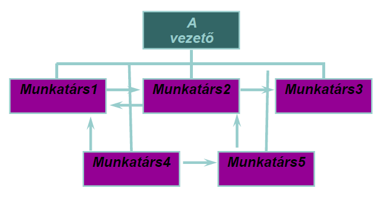
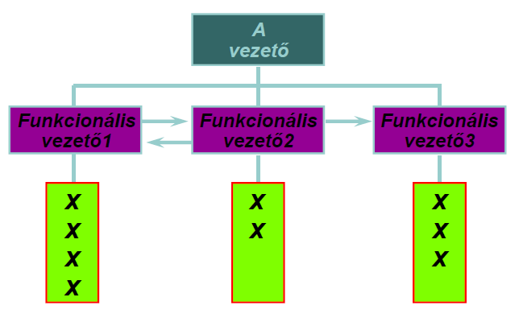
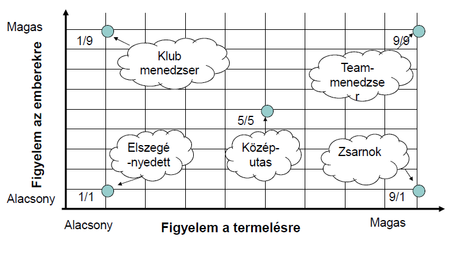

S1-05 Projektirányítás az informatikában
=======================================
Tartalom
---------------------------------------

1. [Informatikai projektek specialitásai és típusai](#chapter01)
2. [A projekt politikai, gazdasági és jogi környezete](#chapter02)
3. [Vállalati szintű tervezés, vállalatok életciklusai](#chapter03)
4. [Projekt szervezet felépítése](#chapter04)
5. [A projekt életciklusa](#chapter05)
6. [Projekttervezés](#chapter06)
    + [feladat és szervezet lebontási struktúra](#section06_01)
    + [időelemzés](#section06_02)
    + [erőforrás-ütemezés](#section06_04)
    + [költségvetés hozzárendelése](#section06_05)
    + [kritikus lánc módszer](#section06_06)
7. [A projektet kísérő folyamatok](#chapter07)
8. [Projektirányítási módszertanok](#chapter08)
9. [Projektirányítás emberi vonatkozásai](#chapter09)
10. [További források](#references)

1.Informatikai projektek specialitásai és típusai 
---------------------------------------

### Alapfogalmak

**Projekt**: 

* A projekt a kitűzött CÉL érdekében kölcsönösen egymásra ható tevékenységek csoportja
* Magába foglal idő-, költség-, erőforrás-, terjedelem-, és minőségtényezőket.

### Informatikai projektek specialitásai

* **Önmagában nincs informatikai projekt**
* Egy informatikai projekt a legtöbb esetben valamilyen köztes lépés, egy nagyobb projekt része
* Ezen felül egy informatikai projekt specialitásai a következők:

    * Sok projektszereplő
    * Sok szakismeret
    * A termék megfoghatatlan, változó és bonyolult
    * A fejlesztési folyamat nehezen szabványosítható
    * Nagy kockázat, egyediség

### Informatikai projektek típusai

* Szoftver(termék) fejlesztési projekt
* Alkalmazásfejlesztési projekt
* Alkalmazásintegrációs projekt
* Rendszerintegrációs projekt
* Bevezetési projekt
* Infrastruktúra fejlesztési projekt
* "Tanulmánykészítési" projekt (előkészítés, felmérés, bevizsgálás)
* Tesztelési projekt

**DE** leginkább ezeknek a keverékeiből áll össze egy informatikai projekt

2.A projekt politikai, gazdasági és jogi környezete 
---------------------------------------

### Politikai környezet

* A vállalatokra közvetett hatással van a politikai környezet amelyben a vállalat él
* A politikai környezet tényezői:
    * politikai stabilitás
    * a politika beleszól a gazdaságba
    * a hatalmi ágak és azok együttműködése

### Gazdasági környezet:

* Már közvetlenül befolyásolja a vállalat életét
* Világgazdasági helyzet, haza gazdasági helyzet, gazdasági növekedés, infláció, beruházási kedv, koncepció
* A munkanélküliség rossz, de rövid távon a vállalatok hasznot húzhatnak belőle, mert könnyebb munkaerőt találni

* Gazdasági szempontból egy vállalatot a SWOT analízis segítségével lehet elemezni. Ennek négy eleme:

    * Erősségek (strengths): Pozitív belső vállalati tényezők, amik a vállalkozás előnyei és fejleszthetjük

        (pl. jó termék, projekt struktúra, üzleti kapcsolatok, stb.)

    * Gyengesége(weaknesses): Negatív belső vállalati tényezők, amik a vállalkozás hátrányai és javíthatunk rajta

        (pl. kevés erőforrás, nem ismert a vállalat, kevés projektvezető, stb.)

    * Lehetőségek (opportunities): Pozitív külső politikai- vagy gazdasági tényezők,
amiket nem tudunk befolyásolni, de kihasználhatjuk előnyként

        (pl. erős hazai/nemzetközi piaci pozíció, EU-s csatlakozás, stb.)

    * Veszélyek (threats): Negatív külső politikai- vagy gazdasági tényezők, amiket nem tudunk befolyásolni,
de fel kell készülnünk rájuk

        (pl. csökkenő gazdasági növekedés, erős konkurencia, stb.)

### A jogi környezet:

* Egy-egy jogszabályhoz való alkalmazkodáshoz időre van szüksége a szervezeteknek

3.Vállalati szintű tervezés, vállalatok életciklusai 
---------------------------------------

* A vállalati szintű tervezés egyik legfontosabb kérdése a szervezeti felépítés
* Ezek a szervezetek lehetnek 
    + formálisak, melyek tulajdonosi és/vagy vezetői döntések alapján jönnek létre
	+ informálisak, melyek spontán emberi kapcsolatok alapján jönnek létre
* Egy vállalat életében mindkét fajta szervezet fontos

### Szervezetek fajtái:

* Egyszerű szervezet

    { width="350px" }

    _Előnyök_: gyors döntés, rugalmasság, csapatmunka, kreativitás

    _Hátrányok_: bizonyos mértéken túl nem működőképes, szervezetlenség, kiszolgáltattság az egyszemélyi vezetőnek

* Funkcionális szervezet

    { width="350px" }

    _Előnyök_: Szakértelem öszpontosítása, egyéni fejlődési lehetőség

    _Hátrányok_: Nincs projekttulajdonos, gyenge kommunikáció, rugalmatlan, gyenge erőforrás koordináció

* Projekt csapat

    { width="350px" }

    _Előnyök_: Széles projektvezetői hatáskör, széles szakértelmű csapat, egyértelmű erőforrás hozzárendelés

    _Hátrányok_: Szakértelem öszpontosítása elvész, csapatok közötti interaktivitás hiánya

A funkcionális szervezet és projekt csapat felépítésű szervezetek között léteznek még ún. mátrix felépítések, melyek
egyfajta átmenetet képeznek a kettő között.

### Vállalatok életútja

* A vállalatok életútja több lépcsőből áll, melyeket az ember életútjainak állomásaihoz lehet hasonlítani
* A különböző életciklusokban a vállalatoknak más-más célkitűzései vannak

4.Projekt szervezet felépítése 
---------------------------------------

### Kis projekt szervezete

**Méret**: 3-5 fő

* Az ilyen méretű projekteknél nincs szükség egy teljes projektvezetői pozícióra, így erre kétféle modell létezik:

    1. A projektvezető egy személyben technikai vezető is, sőt tervezhet, fejleszthet is
    2. Egy adminisztratív projektvezetőhöz több kisebb projekt is tartozik (csak adminisztratív munkát végez)

### Közepes projekt szervezete

**Méret**: 5-20 fő

* Általában már külön munkatárs kell a projektvezető és a technikai vezető szerepekhez
* Megkezdődik a további strukturálás (részcsapatok vezetővel, pl: fejlesztők, tervezők, részprojekt, stb.)

### Nagy projekt szervezete

**Méret**: 20+ fő

* Megjelennek a szervezeti egységeket koordináló irodák, bizottságok (projekt felügyelő bizottság, projektiroda)
* Megjelennek további vezetési szintek
* Asszisztensi pozíciók is megjelennek

5.A projekt életciklusa 
---------------------------------------

A projekt életciklusát hat fázisra lehet osztani:

1. Projekt előkészítés
2. Projektindítás
3. Projekttervezés
4. Projekt követés
5. Projektzárás
6. Projekt utóélete

### Projekt előkészítés

* A projekt előkészítése az **ajánlattétellel** kezdődik
    + ekkor dől el, hogy az ügyfél elfogadja-e az ajánlatot
	+ ekkor került a projektvezető kijelölésre
* Ezek után a **Projekt definíciós dokumentum** (Projektterv) készül el
    + élő dokumentum
	+ a projekt célja, a feladatok meghatározása, a szerepek, az időkeretek, stb lesznek benne meghatározva

### Projektindítás

* A projektet egy projektindítő gyűléssel (Kick-off meeting) szokták kezdeni
    + a résztvevők megismerik a projekt hátterét, célját, hierarchiáját, infrastruktúráját
	+ a felelősségi körökről, fontosabb eljárásokról is esik szó

### Projekttervezés

* A projekttervezés alá minden olyan tervezési folyamat esik, ami a projekt működéséhez szükséges
    + például az időelemzés, erőforrás-ütemezés, stb.

### Projekt követés

* A projekt követés a tervezés és a projektzárás közötti időtartam alatt a projekt megfigyelése
* Ekkor fut a tényleges projekt és készül a termék
* Információgyűjtés, adatösszeítés, elemzés (pl.: állapotjelentés, teljesítmény mérés, stb.) és még további különböző 
tevékenységek a projekt sikeres zárásának érdekében

### Projektzárás

* Egy projekt kétféleképpen érhet véget:

    - vagy teljesült a projekt cél
    - vagy a cél teljesülése előtt különböző okokból:
        + üzleti okokból
        + műszaki okokból
        + terjedelem jelentős megváltozása miatt
        + időzítési okokból
        + költségvetési okokból, stb

* Egy projekt zárása után rendszerint keletkezik egy projektzáró dokumentum
    + a projekt adatai
    + lezárást követő teendők
	+ projekt értékelése, stb

### Projekt utóélete

* A projekt a projektzárással még nem mér véget teljesen
* A projekt lezárása után még alábbi tevékenységek folyhatnak:
    * Üzemeltetés
    * Garanciális hibajavítás
    * Karbantartás
    * Továbbfejlesztés

6.Projekttervezés 
---------------------------------------
### Feladat és szervezet lebontási struktúra 

* A projekttervezés egyik fő célja, hogy meghatározzuk:

    * **MIT** kell csinálni?
    * **KI** fogja megcsinálni?

* Illetve az egyes feladatokat:

    * **HOGYAN** csináljuk meg?
    * **MIKOR** csináljuk meg?
    * Milyen **KÖLTSÉGGEL** csináljuk meg?

* Az első két kérdésre a válaszhoz 
    + a szervezet lebontási struktúrára (OBS - Organizational Breakdown Structure) és
    + a feladat lebontási struktúrát (WBS - Work Breakdown Structure) van szükség

* Ezek után az OBS-t és WBS-t összevetve kiadhatjuk a feladatokat és meghatározhatjuk az felelősségeket

### Időelemzés 

* Az időelemzés célja, hogy meghatározzuk a projekt sikerességéhez szükséges időt, megállapítsuk a határidőt
* Ehhez egy eszköz az irányított hálók használata, melyben a csomópontok közötti élek az összefüggéseket jelentik
    + az összefüggések lehetnek _követési kapcsolatokra_ vonatkozóak (pl. _"B csak akkor kezdődhet el, ha A befejeződött"_)
	+ időre vontakozóak (pl.: X feladat nem fejeződhet be később, mint `<Dátum>` )

* **Kritikus út**: azon tevékenységek sorozata, amely a projekt átfutási idejét meghatározza

* **Időjáték**: egy tevékenységet mennyivel lehet késleltetni anélkül, hogy bármely közvetlenül őt követő másik
tevékenység legkorábbi kezdése késést szenvedne

#### Időterv

* Az időterv a fentiekben leírtaknak megfelelő háló
* Segítéségével meghatározhatjuk az _időjátékot_ és a _Kritikus utat_

* Az időterv értékeinek meghatározásához 
    + először előrefelé haladva meghatározzuk a tevékenységek legkorábbi kezdéseit és befejezéseit
	+ majd visszafele haladva a legkésőbbi kezdéseket és befejezéseket, valamint a teljes időjátékot

* A kritikus útat azok a tevékenységek határozzák meg, melyek teljes időjátéka nulla.

{ width="350px" }

### Erőforrás-ütemezés 

* Ezzel a módszerrel lehetőség nyílik az erőforrás-túlterhelés enyhítésére, megszűntetésére
* Az erőforrás-túlterhelés megoldására többféle lehetősg létezik:
    * az időjáték kihasználásával a nem kritikus tevékenységeket időben eltolva.
    * további erőforrás bevonásával
    * erőforrás átcsoportosításával
    * túlórával
    * határidő eltolással

### Költségvetés hozzárendelése 

* A projekttervezés alatt a költségek megtervezése is rendkívül fontos, melynek elemei a következők:
    * Áru költség
    * Alvállalkozói költség
    * Élőmunka költség
    * Egyéb
        + utazás
        + oktaktás
        + helyiség bérlet, stb

### Kritikus lánc módszer 

* Hasonló a kritikus úthoz, de az erőforrások is figyelembe vannak véve:
* A leghosszabb út, ahol a kritikus erőforrásokat használjuk
* Lényege: a nehezen megkapható erőforrások minél jobban ki legyenek használva
* biztonsági puffer: tartalék idő a kritikus erőforrások előtt

{ width="350px" }

7.A projektet kísérő folyamatok 
---------------------------------------

### Követelménykezelés

* A követelménykezelés azt határozza meg, hogy a projekt mit hoz létre, illetve mekkora a projekt terjedelme.
* A követelményspecifikációban rögzítik
    + élő dokumentum, mely egyre finomodik az ajánlatkéréstől a követelményelemzési fázis befejezéséig
	+ ezután már csak a változáskezelés révén

A követelmények priorizálására egy jó módszer a MoSCoW szabály:

* Must have - nélkülözhetelen
* Should have - fontos
* Could have - lehetne, rövidtávon nélkülözhető
* Would like to have - nélkülözhető, de szeretnénk

### Változáskezelés

* A változáskezelés nem létezik követelménykezelés és konfigurációkezelés nélkül
    + a követelménykezelés kell, hogy tudjunk mihez viszonyítani
	+ a konfigurációkezelés ahhoz kell, hogy követni tudjuk min változtattunk eddig

A változáskezelésnek több célja van:

* az érintett felek jóváhagyásának megszerzése
* a módosítások hatásának felmérése, vizsgálata
* változtatási igények, módosítások dokumentálása

### Kockázatkezelés

* **kockázat**: annak a valószínűsége, hogy előre nem látható esemény következik be

* Az IT projekek kulcskockázatai:
	* feladat méretének növekedése
	* hiba az eredeti becslésben
	* résztvevő (kulcs) munkatárs távozása
	* érdekelt felek közötti egyetértés felborulása

* A kockázatok súlyosságát jellemzőik alapján tudjuk meghatározni:
	* bekövetkezési valószínűség
	* potenciális kár
	* bekövetkezés várható időpontja

8.Projektirányítási módszertanok 
---------------------------------------

* A projektirányítási módszertanok a feladatok megoldásának, elvégzésének, kifejlesztésének módját adják meg, és ehhez
előírásokat, ajánlásokat nyújtanak

### PRINCE 2

* A PRINCE (PRojects IN Controlled Environments) egy folyamatorientált módszer a hatékony projektmenedzsmenthez
* A PRINCE 2 az Egyesült Királyságban a kormány által de facto sztenderdként alkalmazott módszer

### PMBOK

* A PMBOK (Project Management Body of Knowledge) teljes gyűjteménye a folyamatok, legjobb technikáknak, terminológiáknak,
és szabályoknak, melyek a projektmenedzsment iparban sztenderdként elfogadottak.

### CMM, CMMI

* A CMMI (Capability Maturity Model Integration) a legjobb technikákat gyűjti össze annak érdekében, hogy
teljesítménybeli növekedést lehessen elérni

9.Projektirányítás emberi vonatkozásai 
---------------------------------------

### Személyiségi modellek

* A személyiségi modellek megpróbálják bizonyos személyiségi jegyek alapján csoportosítani az embereket
* Segítenek a csapat tagjainak kiválasztásában, motiválásában, a megfelelő kommunikáció kialakításában
* Óvatosan kell azonban kezelni, nem szabad embereket beskatulyázni

#### Myers-Biggs Type Indicator (MBTI)

* Négy féle dimenzió mentén megy a jellemzés:

    1. Extrovertált - Introvertált
    2. Érzékelő - Intuitív
    3. Gondolkodó - Érző
    4. Követő - Rögtönző

### Csapatszerepek

* Töbféle csapatszerepet definiálhatunk, melyeket a személyiségi jegyek alapján kategorizálunk

	* Feladatközpontú szerep
	    + Formáló: szerepek, határok, felelősségi körök kialakítása
	    + Megvalósító: tervek, ötletek kipróbálása, megvalósítása,
	    + Befejező: végrehajtási hibáktól való védelem, célok, határidők, múlasztások
	* Emberközpontú szerep
	    + Koordinátor: csoport céljai, delegáció, döntéshozatal
	    + Csapatmunkás: diplomatikus, csapat tagok közötti interakció, csapatszellem
	    + Lehetőségfelkutató: csoporton kívüli lehetőségek, ötletek, fejlemények
	* Szellemi szerep
	    + Ötletadó: Új ötletek, konstruktív, innovatív, 
	    + Megfigyelő értékelő: problémaelemzés, helyzet, lehetőség, ötlet értékelés
	    + Specialista: speciális szakértelem, csak bizonyos témák, néha hasznos, de akkor nagyon

### Vezetési szerepek, stílusok

* A vezetési stílusokat egy kétdimenziós rácson ábrázolva lehet jellemezni:
	* figyelem az emberekre
	* figyelem a termelésre

* Ezek alapján pedig 5 fajta csoprotot lehet alkotni, ahogy az ábrán is látható:

{ width="350px" }

* 1/1 - elszegényedett
    
    lehetetlen hatékony termlés, az emberek lusták, minimumot teszi meg, főnök mőgé bújik
* 1/9 - klubmenedszer
    
    barátság a lényeg, a termelés mellékes, barátságos légkör, emberi szükségletek
* 9/1 - zsarnok
    
    az emberek gépek, a legtöbbet kell kihozni belőlük, munka elvégzése az erőforrás árán is
* 5/5 - középutas
    
    első a termelés, de a hangulat is fontos, folyamatos engyensúlyozás,
    mindkettőt éppen az elvárásoknak megfelelően, könnyen kiég
* 9/9 - csapat menedzser
    
    hatékony munka előfeltétele a az emberi harmónia, bizalom, tiszteleten alapuló kapcsolat

* Egyik sem recept mindenre (válsághelyzet vs. 9/9)

### Ösztönzés, ösztönzési elméletek

* Az ösztönzésre meglehetősen sok elmélet és modell létezik
* Az ösztönzés folyamata, egy folytonos, körkörös folyamat a _kielégítetlen igény_, a _valamilyen célra irányuló 
tevékenység_, és az _igény kielégítése_ között
* Az embereknek a pénzen és a munkafeltételen kívül más igényeik is vannak, pl.
    + _elismerés_
	+ _valahova tartozás_
 
* Marslow sorrendet állított fel az egyéb szükségletek között:

    1. élettani igény
    2. biztonsági igény
    3. "tartozni valahova" igény
    4. megbecsülés iránti igény
    5. önmegvalósítás igénye

10.További források 
---------------------------------------
* Előadás diasor
* https://www.prince2.com/eur/prince2-methodology
* https://www.wrike.com/project-management-guide/faq/what-is-pmbok-in-project-management/
* http://cmmiinstitute.com/capability-maturity-model-integration
