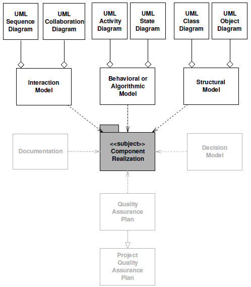
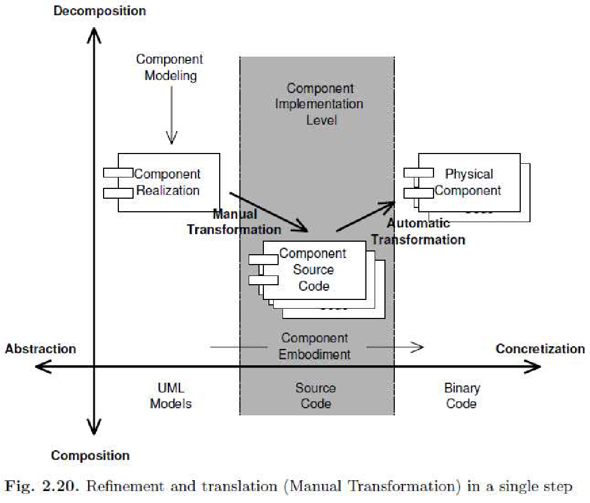
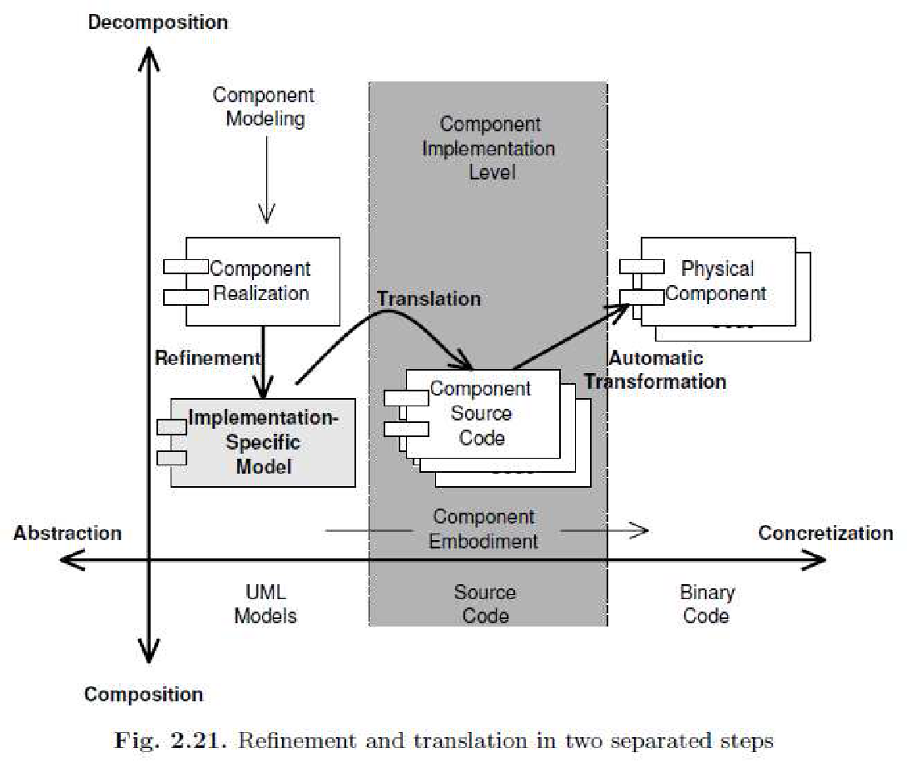
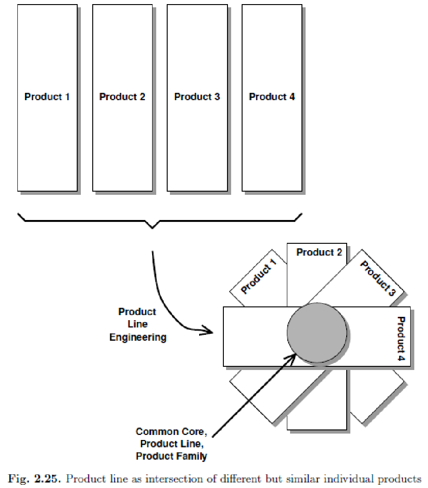
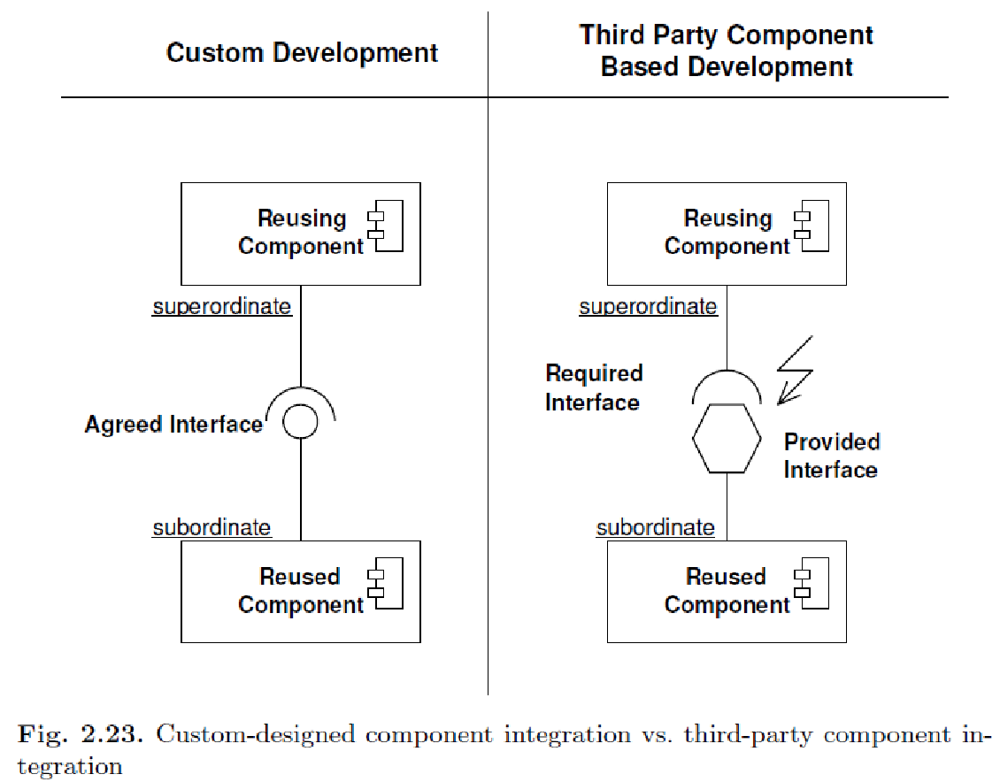
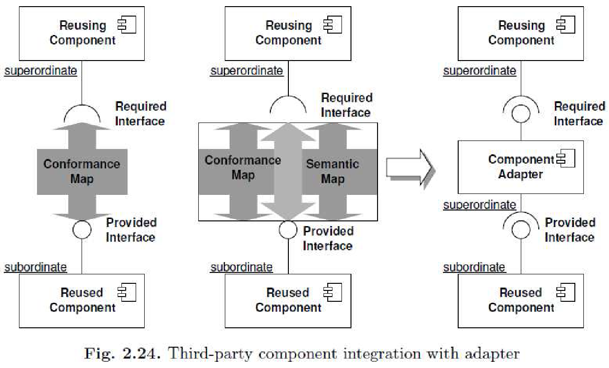

# S01-8 Komponens alapú szoftverfejlesztés 2

## Tartalom

1. [Komponens megvalósítása: kölcsönhatás modell, viselkedési vagy algoritmikus modell és strukturális modell.](#chapter01)
2. [Komponens megtestesítés: finomítás és fordítás, a normál objektum forma (NOF) fogalma, komponensek
újrafelhasználása, polcról levett komponensek, rendszer létrehozása komponensekből, termékcsalád fogalma.](#chapter02)
3. [Rendszer létrehozása polcról levehető komponensekből.](#chapter03)
4. [A burkoló és a híd fogalma, szerepük.](#chapter04)

---
## 1. Komponens megvalósítása 
- azon dokumentumok gyűjteménye, melyek együttesen leírják a komponens megvalósításának módját
- mindent tartalmaz ami a specifikáció alapján történő implementációhoz szükséges
- magasabb szintű komponensek kompozícióval valósíthatók meg
- a kobra modellben az egész termék/alkalmazás is egy nagy komponens, ami kisebb komponensek kompozíciója

**A megvalósítás tartalmazza:**

- az al-komponensek specifikációját és a tőlük elvárt szolgáltatások interfészét
- illetve saját megvalósítását, amely alatt a komponens nem látható privát részének megvalósítását értjük

**A megvalósítás dokumentumai tartalmazzák:**

- a komponens belső felépítésének modelljét UML osztály-, és objektum diagramok formájában
- a komponensben megvalósított algoritmusok specifikációja UML aktivitás diagramok formájában
- más komponensekkel való kölcsönhatásait UML szekvencia és együttműködés diagramokkal

### 1.1 Kölcsönhatás modell
- a vezérlés folyamatát mutatják be a komponens példány perspektívájából
- ezeket kölcsönhatás diagramokkal írjuk le

### 1.2 Viselkedési vagy algoritmikus modell
- a komponens műveleteit részletesebben specifikáljuk: aktivitás diagramokat készítünk, melyekkel leírjuk azokat az algoritmusokat, melyek a specifikációban leírt műveleteket valósítják meg
- a specifikáció viselkedési modelljében leírt műveletek finomítása
- az algoritmus belső, specifikációban nem látható részeinek definiálása
- megadhatjuk a megvalósítás nyelvét is

### 1.3 Strukturális modell
- leírja azon osztályok fajtáit és kapcsolatait amelyekből a komponens felépül
- valamint a komponens belső architektúráját
- a specifikáció strukturális modelljének a finomítása
- olyan elemek is megjelennek amelyek a specifikáció szintjén még nem (pl.: osztályok, a specifikációban még csak komponensek voltak)

## 2. Komponensek megtestesítése (embodiment) 
Azon tevékenységek összefoglaló neve, amelyek során a rendszerünk absztrakt specifikációból konkrétabb, például végrehajtható, vagy telepíthető komponenst hozunk létre.

**A megtestesítés lépései:**

- Keressünk már létező komponenseket, melyek megfelelnek a specifikáció által támasztott követelményeknek
$\Longrightarrow$ Ha nincs ilyen, új komponenst készítünk
- Integráljuk ezeket a rendszerünkbe
- Fordítás (összeépítés)
- Telepítsük a célhardverre

Egy modell transzformálása forráskóddá manuális tevékenység, nem automatizálható, mert a modell és a forráskód szemantikus leírása különbözik: más a jelölésmód (szintaxis) és a leírás szemantikája is

### 2.1 Finomítás és fordítás

**Két alapvető elv:**

- finomítás és fordítás szigorú megkülönböztetése
- használjuk a Normal Object Form (NOF) implementációs profilt, hogy minimalizáljuk az információs szakadékot az OO modellek és az adott OO nyelven elkészítendő program között

**Finomítás:** Egy reláció ugyanazon dolog kétféle leírása között, csak az újabb már jobban részletezett.

**Fordítás:** Egy reláció egy dolog két különböző leírása között, azonos részletességi szinten.

A fenti két lépés alapján a manuális transzformáció felbontása:

- Finomítsuk a komponensünk modelljét első lépésen úgy, hogy egy megfelelően részletes modellt kapjunk.
- Ez a szint már alkalmas arra, hogy onnan transzformációval forráskódot kapjunk.

### 2.2 NOF (Normal Object Form)
- UML profil: az UML kiegészítése nem szabványos elemekkel, melyek segítik a modell leképezését úgy, hogy közben az eredeti modell szemantikus elemeit finomítják. A létrejövő finomított modell így ellentmondásmentes lesz.
- többféle UML profil definiálható egy specifikációs modellhez (tesztelési, implementációs)
- a NOF egy ilyen implementációs profil, mely az UML-t leképezi az OO nyelvek alapvető fogalmaira, majd ez tovább finomítható konkrét programozási nyelvekre

**Elemei:**

- egy olyan UML részhalmaz, mely az implementációs szint elemeinek modellezésére alkalmas
- sztereotípiák mint új modellező elemek
- megszorítások a régi és új elemekre

### 2.3 Komponensek újrafelhasználása

Kompozíció/dekompozíció és absztrakció/konkretizáció dimenziókhoz tartozó aktivitás.
Általában az újrafelhasznált komponens nem felel meg a specifikációnak teljes mértékben, megoldás lehet:

- Az elkészült modell megváltoztatása, de ez szembemegy a modell alapú szoftverfejlesztéssel.
- Az újrafelhasznált komponens átírása → túl bonyolult lehet, vagy akár lehetetlen.
- Átalakító (adapter) komponens bevezetése, pl. wrapper osztály

Ha nem sikerül már meglévő komponenst találni, egy újat kell létrehozni:

- További dekompozíciós lépések lehetnek szükségesek, hogy megtaláljuk az illeszkedő implementációt.
- Ha elkészült, integrálhatjuk az új komponenst a rendszerünkbe.

### 2.4 Polcról levett komponensek (COTS)

**COTS komponens:** egy óriási funkcionalitással felvértezett, gyorsan hozzáférhető, készre csomagolt szoftver. A belsejéről semmit nem tudunk, kizárólag a
funkciói és a kommunikációt bonyolító
interfészei publikusak.

Az összetettebb, nagy rendszerek fejlesztésénél egyre inkább előtérbe kerülnek a polcról levehető, kész komponensek. Fő okai:

- **Gazdaságosság:** kevesebb időt, munkaerőt, ezáltal pénzt emészt fel egy készre gyártott komponens megvásárlása
- **Szakértelem hiánya:** az egyes tudományterületeken olyan mértékű a specializáció, hogy nehézkes és költséges a megfelelő szakemberek alkalmazása

### 2.5 Rendszer létrehozása komponensekből (felépítés, telepítés)

A megtestesítés folyamatának két utolsó lépése tartozik ide, úgy mint a fizikai komponensek elkészítése és azok telepítése a célplatformra.
Különböző telepítési forgatókönyvek léteznek a telepítésre:

- Egy vagy több logikai komponenst egy fizikai komponenssé transzformálunk.
- Egy logikai komponenst több fizikai komponenssé transzformálunk.
- Több logikai komponenst több fizikai komponensé transzformálunk.

Pontos irányelvek nincsenek arra, hogy hogyan konstruáljuk meg és telepítsük fel a rendszerünket.

### 2.6 Termékcsalád fogalma

Azon elvek, amik szerint már eleve újrafelhasználható, generikus komponenseket lehet létrehozni (az eddigiekben egy adott probléma megoldásához készített komponensek újrafelhasználhatóvá tételével foglalkoztunk).
Itt az újrafelhasználás kérdése már az architektúra szintjén jelenik meg.

**Termékcsalád:** egy generikus rendszer vagy pontosabban egy generikus komponens keretrendszer, amely alkalmas több hasonló rendszer létrehozására.

**Termékcsalád mérnökség:** A termékcsalád mérnökség nem más mint egy felhasználó által tervezett komponens újrafelhasználásának egy szervezési módja.

Egy új fejlesztési dimenziót hoz be a szoftverfejlesztésbe, ez az alkalmazás és keretrendszer mérnökség. Az alkalmazás mérnökség a közös mag példányosításával foglalkozik, még a keretrendszer mérnökség a közös mag kifejlesztésével, vagyis:

- Egy keretrendszer kifejlesztésénél ugyanazokat a fejlesztési, modellezési és tervezési lépéseket kell végrehajtani, mint egy egyedi rendszer létrehozásakor.
- Egy keretrendszer nem más, mint komponensek olyan nem teljes összeállítása, amelyet további komponensekkel teljessé kell tenni, hogy egy egyedi rendszer előálljon.
- Egy egyedi rendszer tehát egy generikus termékcsalád egy példánya.

## 3. Rendszer létrehozása polcról levehető komponensekből
Az újrafelhasználhatóság akkor a legegyszerűbb, ha a specifikációk megegyeznek (elvárt és kínált).

A 2.23. ábra baloldala azt az általános esetet mutatja be, amikor a felhasználó a fejlesztést ezen szempontok figyelembevételével készíti el. A 2.23. ábra jobboldala ellenben azt az esetet mutatja be, amikor szintaktikus és szemantikus eltérés van az elvárt és a szolgáltatott interfészek között.

#### Megfelelési térkép elkészítése
- Leírja egy COTS komponens kívülről látható
tulajdonságait egy olyan leképezés segítségével, amely
megadja azt, hogy a COTS komponens kifejlesztésekor
használt jelölés és az általunk használt között mi a
kapcsolat.

#### Szemantikus térkép elkészítése
- Ha egy megfelelési térkép összeállítása után pozitív a
döntésünk egy komponens újra felhasználása
tekintetében, akkor a következő lépés a szemantikus
térkép létrehozása.
- A szemantikus térkép a két komponens (a megtervezett
és a felhasználni szánt) specifikációjának hasonlóságaira
és különbözőségeire koncentrál és megpróbálja
modellezni a leképezést a két eltérő interfész között.

*Megjegyzés: megfelelési térkép - összehasonlíthatóak-e (jelölésrendszer), szemantikus térkép - mi a különbség és a hasonlóság*

## 4. A burkoló és a híd fogalma, szerepük

**Wrapper (burkoló):** egy különleges komponens a beburkolandó komponens és a környezete közé

- hasznos ha nehéz/költséges megváltoztatni a komponenst, amikor egy új rendszerbe akarjuk integrálni
- egyszerűbb lehet a wrapperen keresztül új funkciókat hozzáadni
- használható cache-elésre, bufferelésre

**Bridge (híd):** egy tetszőleges komponens követelményeit fordítja át egy másik komponens számára, hogy biztosítsa neki a szükséges feltételeket

- teljesen független bármely komponenstől
- explicit meg kell hívni kívülről
- pl.: egy híd PostScriptből PDF-et készít
