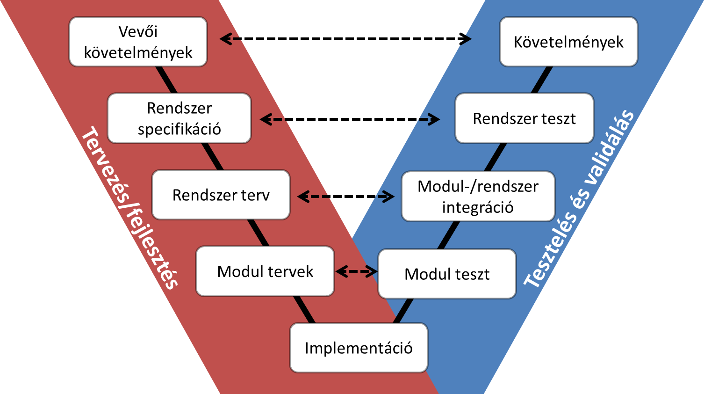

# S01-9 Szoftverfejlesztés minőségi aspektusai

## Tartalom
1. [A szoftverminőség komplex kérdésköre, termék és folyamat alapú megközelítés.](#chapter01)
2. [A szoftverfejlesztés és a tesztelés kapcsolata, V modell, agilitás.](#chapter02)
3. [A tesztelés szintjei.](#chapter03)
4. [A tesztelés életciklusa.](#chapter04)
5. [Teszttervezési technikák.](#chapter05)
6. [Specifikáció alapú: ekvivalencia-osztályozás, határérték elemzés, döntési táblák, állapotgépek,
használati eset tesztelés; struktúra alapú: utasítás és döntési lefedettség.](#chapter06)
7. [Review technikák, statikus tesztelés.](#chapter07)
8. [A tesztelés dokumentálása.](#chapter08)
9. [Teszteszközök.](#chapter09)

---
## 1. A szoftverminőség komplex kérdésköre, termék és folyamat alapú megközelítés. 
Az, hogy mi a minőségi szoftver attól függ, hogy kit kérdezünk meg. pl.:
- megrendelő: költséghatékony
- felhasználó: könnyű használni, segíti a munkát
- fejlesztő: könnyű fejleszteni/karbantartani
- fejlesztés menedzsment: profitot termel

Két fő megközelítése van a szoftverminőségnek: termék és folyamat alapú megközelítés.

### 1.1 Folyamat alapú megközelítés
- annak biztosítása, hogy minden köztes termék egy fejlesztési folyamatban jó minőségű legyen, kielégítse a
belső ügyfelek igényeit akiknek a következő lépést kell végrehajtaniuk
- továbbá, hogy a fejlesztési folyamat során használt technológiák, módszerek és eszközök ellenőrzés alatt álljanak,
illetve, hogy fejlődjenek
- sok szervezeti keretrendszer van amelyek használatával növelhetjük a folyamatok minőségét, pl.:
  - SPICE
  - Plan-Do-Check-Act

### 1.2 Termék alapú megközelítés
- a termék magába foglalja a futtatható programokat, a forráskódot,
az architektúrát tartalmazó dokumentumokat stb.
- ezek alapján a felhasználók csoportja sokkal tágabb
- az ISO/IEC 9126 szabványban rögzítették a minőségi karakterisztikákat, amelyek al-karakterisztikákra, az
al-karakterisztikák pedig attribútumokra oszlanak fel
- a szabványban csak a karakterisztikák és az al-karakterisztikák vannak meghatározva, az attribútumok nem mert azok
termékenként változhatnak
- az attribútumok már ellenőrizhető és mérhető entitások
- a szabvány egy keretet biztosít a termék minőségi modelljének meghatározásához
a szervezetek feladata a saját modell pontos meghatározása
- az ISO/IEC 9126 szabványt leváltotta a ISO/IEC 25010:2011 szabvány mely a következő ábrán látható

## 2. A szoftverfejlesztés és a tesztelés kapcsolata, V modell, agilitás. 
- a tesztelés önmagában nem létezik, a tesztelési tevékenységek szorosan a fejlesztési tevékenységekhez kapcsolódnak
- egy szoftverfejlesztési model folyamatok és módszerek gyűjteménye, a tesztelés ennek a része
- a szoftverfejlesztési modellt a projekt céljainak megfelelően választjuk meg
- a különböző fejlesztési élet-ciklus modellekhez más és más tesztelési megközelítés szükséges

### V-modell
- a vízesés modell egy kiterjesztése
- a vízesés modellben a tesztelés csak a projekt késői fázisában lett végrehajtva, így a hibák későn derültek ki
- a V-modell útmutatást nyújt ahhoz, hogy a tesztelést a lehető legkorábban el kell kezdeni az életciklusban
- azt is mutatja, hogy a tesztelés nem csak végrehajtás alapú tevékenység
- ezeket a tevékenységeket a fejlesztéssel párhuzamosan kell elvégezni, és a tesztelőknek együtt kell működniük a fejlesztőkkel, üzleti-elemzőkkel
- a teszttervezés korai elkezdésével gyakran megtalálhatóak a hibák a tesztelési alapdokumentumokban
- jó gyakorlat ha már ezen dokumentumok review-olása során bevonják a tesztelőket

### Agilitás
- szoftverfejlesztési modellek egy csoportja, ahol a szoftverkövetelmények és a megoldások együttműködésen keresztül
együtt fejlődnek az önszerveződő és multifunkcionális csapatok között
- elősegíti az alkalmazkodó tervezést, az evolúciós fejlesztést, folytonos továbbfejlesztést és bátorít a változásokra
adható gyors és rugalmas válaszokra

Például ilyen agilis módszer az Extreme Programming (XP), főbb alapelvei:

- tervezés: a követelményeket és azok prioritását az ügyfelek határozzák meg
- kis release-ek: egyszerű, működő szoftver amelyet folyamatosan fejlesztenek
- egyszerűség: lehető legegyszerűbb megoldások alkalmazása
- TDD (Test Driven Development) - tesztek írása kódolás előtt
  1. írjunk teszteket - futtassuk, nyilván pirosak lesznek
  2. kódolás - amíg a teszteset nem lesz zöld
  3. re-faktorálás - továbbra is zöld marad a teszt
- pair-programming
- közös tulajdon a kód - közös felelősség
- continous integration
- belső ügyfél
- kódolási konvenciók

## 3. A tesztelés szintjei. 
## 4. A tesztelés életciklusa. 
## 5. Teszttervezési technikák. 
## 6. Specifikáció alapú és struktúra alapú tesztelés 
## 7. Review technikák, statikus tesztelés. 
## 8. A tesztelés dokumentálása. 
## 9. Teszteszközök. 

## További források
