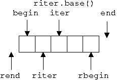
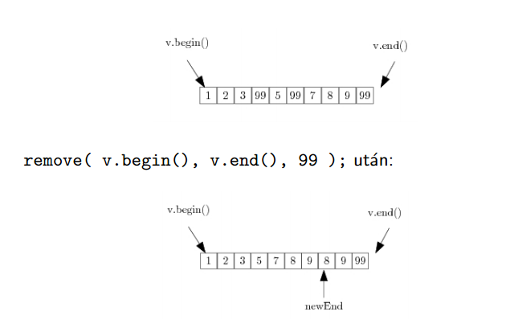
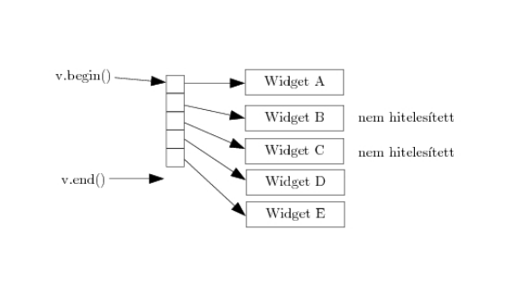
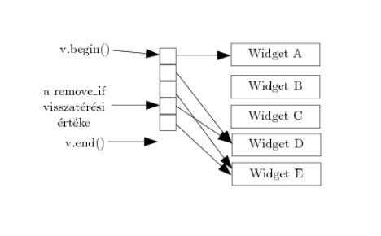

# S02-3 Multiparadigma programozás és Haladó Java 2

## Tartalom

1. [Generikus programozás, típussal való paraméterezés, példányosítás és típustörlés](#chapter01)
2. [A C++ standard template könyvtár.](#chapter02)
    1. [Konténerek és iterátorok](#section01_01)
    2. [Funktorok](#section01_02)
    3. [Algoritmusok](#section01_03)
3. [Java annotációk](#chapter03)
4. [Önelemzés, osztálybetöltés](#chapter04)
5. [Objektumszerializáció](#chapter05)

---
## 1. Generikus programozás, típussal való paraméterezés, példányosítás és típustörlés <a name="chapter01"></a>
- A sablonoknak hasonló a célja mint a függvényeké: csökkenti a kódredundanciát
    - metódus: érték paraméterez metódus törzset
    - sablon: típus paraméterez osztályt
- Így sablonnal csak egy osztályt kell megírnunk, nem kell az összes típusra megírni amivel használni szeretnénk
- pl:

```Java
class Pair<T1, T2> { T1 elem1; T2 elem2; }
```

*Megjegyzés: ezt úgy is megvalósíthatnánk, hogy ```class Pair {Object elem1; Object elem2; }``` viszont ebben az esetben
akkor nekünk kellene mindenhova a típuskényszerítéséket leírnunk. -> sok hibalehetőség*

- **példányosítás:** a sablon konkrét paraméterekkel való ellátása
- sablon paraméter megjelenhet a műveletekben formális paramétereként, lokális változó, és műveltek visszatérési
érték típusában
    - **reification:** sok nyelvben minden példányosítás külön típust hoz létre. pl: `Pair<String Character>`
    a `PairSC` típushoz, a `Pair<double[], Boolean>` a `PairDB` típushoz hasonló típust hoz létre.
    A `PairSC` olyan mint a fenti kód csak `T1`, `T2` helyett a konkrét típusok vannak: String és Character
    - **típustörlés:**
        - a típusértékek minden előfordulás helyére `Object` kerül a fordítás során, vagy ha megszorításokat
        (`Example<T extends String>`) alkalmaztunk akkor specifikusabb típus is kerülhet a helyére.
        - a futtatórendszer nem is tud a típusparaméterekről
        - törlés előtt a fordító megvizsgálja, hogy típushelyesen használjuk-e a sablonpéldányokat
        - nem lehetnek primitív típusok, hiszen azokat nem lehet `Object`-el helyettesíteni
        - a fordító legenerálja a típuskényszerítéseket
        - ha fordul a kód akkor futási időben biztos, hogy nem kapunk típuskényszerítés miatt hibát
        - `List<Integer>` nem altípusa `List<Number>`-nek hiába `Integer <: Number` igaz: gondoljunk bele, hogy létre
        hozunk egy `Integer`-ek listáját, majd azt értékül adjuk egy `Object`-eket tartalmazó listának
        (itt lesz fordítási hiba) akkor az `Integer`-ek listájába pakolhatnánk mindenféle `Object`-et

## 2. C++ Standard Template Library <a name="chapter02"></a>
- STL-t (Standard Template Library) még a C++ standardizálása előtt hozták létre
- A C++ Standard Library sok részére hatással volt, illetve sok mindent átvettek az STL-ből, az STL eredeti fejlesztői is
résztvettek a C++ Standard Library megalkotásában.
- Tehát az STL nem része a C++ szabványnak, illetve nem összekeverendő a kettő
- Manapság amikor a C++ Standard Template Library-ről beszélünk akkor a Standard Library-ban lévő dolgok egy
részhalmazára gondolok, mégpedig a következőkre:
    - algoritmusok
    - konténerek
    - funktorok
    - iterátorok
- mitől "Template"?
    - a konténerek bármely beépített típussal használhatóak, vagy felhasználó által definiált típussal is, ha az
    megvalósít néhány alapvető metódust, pl: értékadás
    - az algoritmusok a konténerektől függetlenek, amely leegyszerűsíti a könyvtár komplexitását
    - ereje a template-ek használatában rejlik, amely fordítási idejű polimorfizmust tesz lehetővé

### 2.1 Konténerek és iterátorok <a name="section01_01"></a>
- Sequence konténerek
    - array
    - vector
    - deque
    - forward_list
    - list
- Adapterek
    - stack
    - queue
    - priority_queue
- Asszociatív konténerek
    - set
    - multiset
    - map
    - multimap
- Rendezetlen asszociatív konténerek
    - unordered_set
    - unordered_multiset
    - unordered_map
    - unordered_multimap

#### Asszociatív konténerek
- rendezettség, összehasonlító típus
- keresőfa
- ekvivalencia
- logaritmikus bonyolultságú műveletek
- ekvivalens a és b:
    - `(!(a < b) && !(b < a))`
    - általános eset:
        - `(!(s.key_komp() (a, b)) && !(s.key_komp() (b, a)))`
- `multiset` és `multimap` esetén az ekvivalens elemen sorrendje nem definiált
- általánosan igaz, hogy megegyező értékekre a predikátumoknak hamisat kell visszaadniuk
    - multikonténereknél is
    - különben a konténer invaliddá válik

#### Iterátorok

- iterátorok arra jók, hogy végig tudjuk járni a konténereket
- 5 fő típusa van
    - Input: előrefelé tudunk menni, illetve olvasni, módosítani nem, `*i` csak rvalue-ként használható
    - Output: előrefelé tudunk menni, illetve csak írni, olvasni nem, `*i` csak lvalue-ként használható
    - Forward: előrefelé, írni olvasni
    - Bidirectional: előre, hátra tudunk menni, illetve írni olvasni
    - Random access: random hozzáférést tesz lehetővé, nem csak egyesével tudunk lépkedni, írni olvasni tudunk
- `vector`: random access iterátor
- `deque`: random access iterátor
- `list`: Bidirectional
- asszociatív konténerek: Bidirectional
- iterátorok invaliddá válhatnak:
    - `vector`-nál ha re-allokáció történik akkor minden invaliddá válik: iterátorok, referenciák, pointerek
    - `deque`-nál:
        - széléről való törléskor csak a szélső iterátorok válnak invaliddá
        - középről való törléskor minden invaliddá válik: iterátorok, referenciák, pointerek
        - beszúráskor az összes, ha középre szúrtunk be, szélre való beszúráskor csak az iterátorok, a pointerek és
        referenciák megmaradnak
- példa: `std::vector<double>::iterator i = v.begin()`
- iterátorok fajtái:
    - `const_iterator`
    - `reverse_iterator`
    - `const_reverse_iterator`
    - `istream_iterator`, `ostream_iterator`
    - `istreambuf_iterator`, `ostreambuf_iterator`

#### Vector re-allokáció

- `vector` re-allokáció folyamata:
    - új memóriaterület allokálása
    - elemek átmásolása
    - régi elemek megszüntetése
- re-allokáció költséges, illetve invalid iterátorokhoz vezet
- a kapacitás nem csökken automatikusan
- swap trükk:

```C++
vector<int> v;
//...
vector<int>(v).swap(v);
```

- C++ 11-től van `v.shrink_to_fit()`
- van `iterator` -> `const_iterator` konverzió, viszont visszafele nincs érthető okokból
- van `reverse_iterator` -> `iterator` konverzió a `base()` tagfüggvénnyel, ami trükkös, lásd a következő képet



- tehát i = ri.base() máshova fog mutatni
- törléskor ezért nem lesz jó, de beszúráskor még jó

#### Speciális iterátorok
```C++
// másoljuk a std.input-ot std.output-ra...
copy( istreambuf_iterator<char>( cin ),
      istreambuf_iterator<char>(),
      ostreambuf_iterator<char>( cout ) );
```

### 2.2 Funktorok <a name="section01_02"></a>
- olyan objektumok amelyeknek van `operator()`-a globális függvényhívások szimulálására
- objektumok - állapotok, adattagok, egyéb tagfüggvények
- hatékonyak
- speciális hibák elkerülése
- két ősosztály van: `unary_function`, `binary_function` sablonok
- C++ 11-től a lambdákkal kiválthatók
- `unary_function`, `binary_function`:
    - speciális `typedef`-eket biztosítanak
    - a `typedef`-ekre szükségük van a függvényobjektum adaptereknek: `not1`, `not2`...
    - ezek sablon osztályok és származtatni példányokból lehet
    - `unary_function` két sablon paraméter
    - `binary_function` két sablon paraméter
    - az utolsó paraméter mindig a visszatérési érték
    - az első, vagy első kettő, az `operator()` paramétere illetve paraméterei, értelem szerűen unary esetén 1, míg
    binary esetén kettő
- ha függvényekre akarjuk használni az adaptereket akkor direktbe ezt nem tudjuk megtenni, mert hiányoznak a `typedef`-ek
- `ptr_fun` lehet a segítségünkre, ami egy alkalmazkodóképes funktort ad vissza aminek az `operator()`-a majd meghívja
az eredeti függvényt

```C++
bool is_even( int x );
// Első páratlan szám megkeresése:
list<int> c;
//...
list<int>::iterator i = find_if( c.begin(), c.end(),  not1( ptr_fun( is_even ) ) );
```

- `mem_fun_ref`: lehetőséget ad arra, hogy a sorozat minden elemére meghívjuk az elemnek egy tagfüggvényét

```C++
struct Foo
{
    void bar();
};
list<Foo> c;
// bar meghívása c összes elemén?
for_each( c.begin(), c.end(), mem_fun_ref( &Foo::bar ) );
```

- `mem_fun`: ugyan az mint az előbbi csak ha bar virtuális metódus akkor a dinamikus típusnak megfelelőt fogja
meghívni

```C++
struct Figure
{
    virtual void draw() const = 0;
    virtual ~Figure() { };
};
//...
list<Figure*> c;
// draw meghívása (a dinamikus típusnak megfelelő):
for_each( c.begin(), c.end(), mem_fun( &Figure::draw ) );
```
- funktoroknál elvárás, hogy ne tartson fenn olyan változót, illetve ne érjen el, amely befolyásolja az `operator()`
eredményét, azaz az operátor értéke csak a paraméterektől függjön. Ez azért van így mert az algoritmusok másolatokat
készíthetnek a funktorokról

### 2.3 Algoritmusok <a name="section01_03"></a>

- `find`
- `binary_search`: true ha talál ekvivalens elemet
- `lower_bound`: iterator az első ekvivalens elemre
- `upper_bound`: iterator az utolsó utáni ekvivalens elemre
- `equal_range`: visszaad egy sub iterator-t amiben a paraméterben kapott értékkel ekvivalens elemek vannak
- a \*\_bound algoritmusok tehát olyan mint az `equal_range` által visszaadott iterator `begin()` és `end()`-je

- remove_(if)
    - igazából nem töröl, mivel konténer független az algoritmus, nem tudja, hogy kell
    - átrendezi a konténer elemeit, hogy a megmaradóak előre kerüljenek, amíg a többi a végén
    - végén általában változatlanok az elemek
    - visszaad egy iterátort ami az új logikai végét jelenti a konténernek
    - helyesen úgy tudjuk használni utána a konkrét konténer `erase` függvényét meghívjuk
        - `c.erase( remove( c.begin(), c.end(), t ), c.end() );`



\newpage

- remove_if probléma -> memory leak





\newpage

- látható, hogy elvesztettünk néhány referenciát, megoldás lehet ha előbb végigmegyünk a listán, és de-allokáljuk a
dinamikusan foglalt memóriát, majd null-ra állítjuk a pointereket
- ez után töröljük a nullpointereket a `remove_if`-el
- bizonyos konténerek esetén léteznek olyan tagfüggvények melyek neve (illetve célja) megegyezik egy algoritmuséval
- pl.: assoccont::find
- mindig válasszuk, ha lehet a konténerét mert hatékonyabb, helyes működés
- ciklusok helyett használjuk az algoritmusokat:
    - hatékonyság
    - érvénytelen iterátorok elkerülése
    - javíthat a kód átláthatóságán

## 3. Java annotációk <a name="chapter03"></a>
- módosítószavak bővítése
- a programszöveg elemeihez rendelhetők
    - csomagokhoz, típusokhoz, metódusokhoz, ...
- plusz információt hordoznak
    - a java fordító számára
    - speciális eszközök számára

```Java
public @interface Copyright {
    String value();
}

@Copyright(value="Copyright: Bender")
public class Metal {
//...
}
```

- @ speciális karaktert használjuk
- megszorítások
    - nem lehet generikus
    - a metódusok benne
        - nem lehetnek generikusok
        - nem lehet paraméterük
        - a visszatérés érték típusa
            - primitív
            - String
            - Class vagy annak példányosítása
            - felsorolási
            - annotációs
            - ezekból képzett 1 dimenziós tömb
    - nem lehet szülőinterfésze
    - nem lehet throws klózuk
- Implicit módon kiterjeszti a java.lang.annotation.Annotation interfészt
- Lehet belőle leszármaztatni
- Nem lehet rekurzív a definíciója
- Nem ütközhetnek metódusai az `Object` és az `Annotation` metódusaival (felüldefiniálás-ekviv.)
- elemei: nulla, egy vagy több
- nulla: marker annotációnak nevezzük, elhagyható az üres zárójel
- egy: konvenció, hogy a neve legyen `value`, ezáltal nem muszáj kiírni, hogy `value="blah"`
- default kulcsszóval alapértelmezett értéket rendelhetünk hozzá
    - `String date() default "[not_defined]";`
- az annotációkat egymásba ágyazhatjuk: `@Author(@Name(...))`
- Meta-annotáció:
    - annotációk annotálása
    - önmagát is annotálhatja
- előre definiált annotációk:
    - Target
    - Retention
    - Inherited
    - Override
    - SupressWarnings
    - Depracated

## 4. Önelemzés, osztálybetöltés <a name="chapter04"></a>
- önelemzés nem egyenlő a dinamikus kötéssel
- egy típusleíró fájl alapján
    - osztályok
    - interfészek
    - annotációk
    - felsorolási típusok
- futás közben: API van hozzá (`java.lang.reflect`)

```Java
import java.lang.reflect.*;
class Example {
    public static void main(String[] args) throws Exception {
        Class c = Class.forName(args[0]);
        Class[] formalArgs = (args.length > 2)
                                ? new Class[] {String.class}
                                : new Class[] {};
        Object o = c.newInstance();
        Method m = c.getMethod(args[1],formalArgs);
        Object[] actualArgs = (args.length > 2)
                                ? new Object[] {args[2]}
                                : new Object[] {};
        System.out.println( m.invoke(o,actualArgs) );
    }
}
```

- Class objectumok esetén: hozzáférhetünk a `getClass()` metódussal
    - `"Hello".getClass()` -> String
- `.class` használatával ha nincs objektumunk, csak a típus, pl.: `String.class`
- `forName`
    - típusbetöltés paraméterezhetően, teljesen dinamikusan
    - fordításhoz nem kell a típus
    - futtatáskor a classpath-ben kell lennie
        - pl.: `Class.forName("java.util.List")`
- két fajta hiba léphet fel betöltéskor:
    - `ClassNotFoundException`
    - `LinkageError`
- A `Class` osztály generikus, pl a `String` típus típusleíró objektuma  `Class<String>` típusú
- metódusok amelyek `Class`-t adnak vissza:
    - `Class.getSuperClass()`
    - `Class.getInterfaces()`
    - `Class.getClasses()`
- egy class tulajdonságai:
    - módosítók
    - típusparaméterek
    - szülőosztály
    - csomag
    - konstruktorok
    - tagok
- módosítók lekérdezése:
    - annotációk: külön erre a célra való műveletek
    - nem annotáció módosítók maszkolással:
        - a `getModifiers()` egy integert ad vissza
        - az int-ből maszkolással nyerhető ki a módosítók
        - kinyerésre vannak speciális műveletek:
            - `public static boolean isStatic(int mod)`
- publikus információk:
    - `getMethods()`, `getFields()`, ...
    - örököltek is
- minden információ:
    - `getDeclaredMethods()`, ...
    - az örököltek nem
- a `Class.newInstance()` segítségével példányosíthatjuk az osztályt, az osztály paraméter nélküli konstruktorával
- a `Constructor.newInstance` ugyan az, de nem csak paraméter nélküli lehet
- típuskényszerítés a `public T cast(Object obj)` segítségével
- dinamikus típusellenőrzés a `public boolean isInstance(Object obj)` használatával
- lekérdezések: `isArray()`, `isPrimitive()`
- `java.lang.reflect.Member` interfész
    - `java.lang.reflect.Field`
    - `java.lang.reflect.Method`
    - `java.lang.reflect.Constructor`
- A Class-ból kiindulva megszerezhetők
- értéklekérdezés, beállítás:

```Java
Class<Point> c = Point.class;
Object o = c.newInstance();
Field x = c.getField("x");
x.setInt(o,12);
Point p = c.cast(o);
System.out.println(p.x);
```

- önelemzés tulajdonságai:
    - pozitív:
        - rugalmasság
        - újrafelhasználhatóság
        - továbbfejleszthetőség, adaptálhatóság
    - negatívum:
        - költséges
        - futási idejű hibák:
            - nem talál valamit
            - nincs joga valamihez
        - biztonsági problémák:
            - privát tagokhoz hozzáférés
- mire használjuk:
    - előre nem ismert kódot manipuláló kód írásánál:
        - keretrendszerek
        - EJB
        - vizuális szerkesztők
        - nyomkövető, log rendszerek
    - generatív programozás
    - kóddal paraméterezhető kód

## 5. Objektumszerializáció <a name="chapter05"></a>
- objektum elmentése -> rekurzívan az általa hivatkozott objektumok mentése is
- hivatkozott objektum többszöri előfordulása esetén csak egyszer lesz elmentve
- a Serializable interfész megvalósításával érhetjük el
    - ennek nincsenek metódusai, csak oda kell rakni az osztályhoz
    - csak arra a célra szolgál, hogy megjelöljük mint szerializálható osztályt
- a szerializációt a Java elvégzi helyettünk
- ha valami speciális dolgot kell csinálni az osztályunkkal szerializáció során akkor a következő metódusokat kell
implementálnunk
    - `writeObject`
    - `readObject`
    - `readObjectNoData`
- mi történik:
    - metainformációk elmentése (objektum osztály, verzió)
    - objektum adattagjainak elmentése
    - hivatkozott objektumok rekurzív mentése
    - korábban mentett objektum helyett egy mutató mentése
- `transient` kulcsszó: ha az adattagot nem akarjuk szerializációkor menteni
- a szerializáció során mindegyik osztályhoz hozzárendelésre kerül egy verzió szám melynek neve `serialVersionUID`, ezt
a futtató környezet arra használja, hogy de-szerializáció során megbizonyosodjon arról, hogy az objektum küldője és
fogadója kompatibilis osztályt használnak
- ha a két verzió különbözik akkor egy `InvalidClassException` kivételt kapunk
- a verziót a `Serializable` interfészt megvalósító osztályunkban a `serialVersionUID` mező deklarálásával
adhatjuk meg, amelynek `static`, `final` és `long`-nak kell lennie
    - pl.: `static final long serialVersionUID = 42L`
- ha nem adjuk meg akkor generál nekünk egyet, de warning-ot kapunk

## További források
- Előadás anyagok
- http://www.cplusplus.com/reference/stl/
